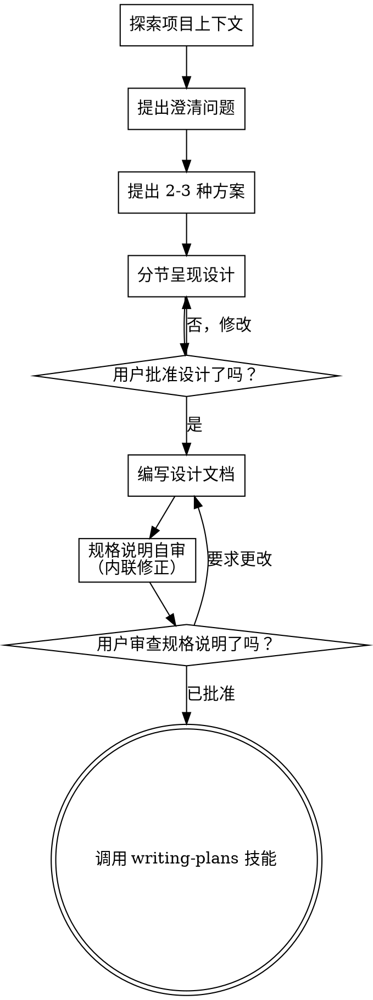

# 通过头脑风暴将想法转化为设计

通过自然的协作式对话，帮助将想法转化为完整成形的设计和规格说明。

首先了解当前项目的上下文，然后一次提出一个问题来完善想法。一旦你理解了要构建的内容，就展示设计并获得用户批准。

<HARD-GATE>
在你展示设计并获得用户批准之前，不得调用任何实现技能、编写任何代码、搭建任何项目脚手架或采取任何实现行动。无论项目看起来多么简单，这都适用于每一个项目。
</HARD-GATE>

## 反模式：“这太简单了，不需要设计”

每个项目都要经过这一流程。待办事项列表、单函数实用工具、配置变更——无一例外。“简单”项目最容易因未经审视的假设而造成最多的工作浪费。设计可以很简短（对于真正简单的项目，只需几句话），但你必须展示设计并获得批准。

## 清单

你必须为以下每一项创建一项任务，并按顺序完成它们：

1. **探索项目上下文**——检查文件、文档和最近的提交
2. **在恰当时机提供视觉伴侣**——不要预先提供。当某个问题第一次确实用展示比用描述更清楚时，就在那时提出使用它（用一条单独的消息）；获得批准后，它的浏览器标签页会为你打开。如果始终没有出现视觉问题，就绝不要提出使用它。参见下方的“视觉伴侣”一节。
3. **提出澄清问题**——一次一个，了解目的、约束和成功标准
4. **提出 2-3 种方案**——说明权衡取舍和你的建议
5. **展示设计**——按复杂度划分并调整各节内容，每展示一节后都要获得用户批准
6. **编写设计文档**——保存到 `docs/superpowers/specs/YYYY-MM-DD-<topic>-design.md` 并提交
7. **规格说明自审**——快速进行内联检查，查找占位符、矛盾、歧义和范围问题（见下文）
8. **用户审查已写好的规格说明** — 请用户在继续之前审查规格说明文件
9. **过渡到实现** — 调用 writing-plans 技能来创建实现计划

## 流程

**终止状态是调用 writing-plans。** 绝不要调用 frontend-design、mcp-builder 或任何其他实现技能。在 brainstorming 之后，你调用的唯一技能是 writing-plans。

## 流程

**理解想法：**

- 首先查看当前项目状态（文件、文档、最近的提交）
- 在询问详细问题之前，先评估范围：如果请求描述了多个相互独立的子系统（例如，“构建一个包含聊天、文件存储、计费和分析的平台”），应立即指出这一点。不要把问题浪费在细化一个首先需要拆分的项目的细节上。
- 如果项目规模过大，无法用一份规格说明涵盖，请帮助用户将其拆分为多个子项目：哪些是独立的部分、它们如何关联、应按什么顺序构建？然后按照正常的设计流程，对第一个子项目进行头脑风暴。每个子项目都有其自己的规格说明 → 计划 → 实现周期。
- 对于范围适当的项目，每次询问一个问题以细化想法
- 尽可能优先使用多项选择题，但开放式问题也可以
- 每条消息只问一个问题——如果某个主题需要进一步探索，请将其拆成多个问题
- 专注于理解：目的、约束、成功标准

**探索方案：**

- 提出 2-3 种不同的方案，并说明各自的权衡
- 以对话方式呈现选项，并给出你的建议和理由
- 先介绍你推荐的选项，并解释原因
- 坚决贯彻 YAGNI——从每一种方案和设计中移除不必要的功能

**呈现设计：**

- 一旦你确信自己理解了要构建的内容，就呈现设计
- 根据每个部分的复杂程度调整篇幅：如果简单直接，就用几句话；如果细节微妙复杂，则最多使用 200-300 词
- 在每个部分之后询问目前看来是否正确
- 涵盖：架构、组件、数据流、错误处理、测试
- 如果有些内容不合理，随时准备返回并澄清

**为隔离性和清晰性而设计：**
- 将系统拆分为更小的单元，每个单元都有一个明确的用途，通过定义清晰的接口进行通信，并且可以被独立理解和测试
- 对于每个单元，你都应该能够回答：它做什么、如何使用它，以及它依赖什么？
- 其他人能否在不阅读某个单元内部实现的情况下理解它做什么？你能否在不破坏使用方的情况下更改其内部实现？如果不能，就需要改进边界。
- 更小且边界清晰的单元也更便于你处理——对于能够一次性纳入上下文的代码，你可以进行更好的推理；当文件职责集中时，你的编辑也会更可靠。当一个文件变得很大时，这通常表明它承担了过多职责。

**在现有代码库中工作：**

- 在提出更改之前，先探索当前结构。遵循现有模式。
- 如果现有代码存在影响这项工作的问题（例如，文件变得过大、边界不清晰、职责纠缠），应将有针对性的改进纳入设计——就像优秀的开发者会改进自己正在处理的代码一样。
- 不要提出无关的重构。始终专注于服务当前目标的内容。

## 设计之后

**文档：**

- 将经过验证的设计（规格说明）写入 `docs/superpowers/specs/YYYY-MM-DD-<topic>-design.md`
  - （用户对规格说明位置的偏好会覆盖此默认设置）
- 如果可用，使用 elements-of-style:writing-clearly-and-concisely 技能
- 将设计文档提交到 git

**规格说明自审：**
写完规格说明文档后，以全新的视角审视它：

1. **占位符扫描：** 是否有任何 "TBD"、"TODO"、未完成的章节或模糊的要求？修复它们。
2. **内部一致性：** 是否有任何章节相互矛盾？架构是否与功能描述一致？
3. **范围检查：** 范围是否足够聚焦，可以用单个实现计划完成，还是需要进行拆分？
4. **歧义检查：** 是否有任何要求可能被理解为两种不同的含义？如果有，选择一种并明确写出。

直接修复所有问题。无需再次审查——修复后继续推进。
**用户审查关卡：**
规格审查循环通过后，在继续之前，请用户审查已写好的规格说明：

> “规格说明已写入 `<path>` 并提交。请审查它，并告诉我在我们开始编写实施计划之前，你是否希望进行任何更改。”

等待用户回复。如果他们要求更改，就进行更改并重新运行规格审查循环。只有在用户批准后才能继续。

**实施：**

- 调用 writing-plans 技能来创建详细的实施计划
- 不要调用任何其他技能。writing-plans 是下一步。

## 可视化伴侣

一个基于浏览器的伴侣工具，用于在头脑风暴期间展示原型图、图表和可视化选项。它作为工具提供——而不是一种模式。同意使用该伴侣工具，意味着它可用于那些采用可视化方式会更有帮助的问题；这并不意味着每个问题都要通过浏览器进行。

**提供伴侣工具（即时）：** 不要一开始就提出使用它。等到某个问题确实用展示的方式会比口头描述更清楚时——真正涉及原型图 / 布局 / 图表的问题，而不仅仅是一个 UI *话题*。第一次出现这种情况时，就在那时提出使用它，并且该提议要单独作为一条消息：
> “接下来的这部分如果展示给你看，可能会更容易理解——在我们推进的过程中，我可以在浏览器标签页中制作原型图、图表和对比内容。它仍是新功能，并且可能会消耗大量 token。你想让我这样做吗？我会为你打开它。”

**此提议必须单独作为一条消息发送。** 只发送该提议——不要包含澄清问题、摘要或任何其他内容。等待用户回复。如果他们接受，使用 `--open` 启动服务器，以便他们的浏览器自动打开第一个界面。如果他们拒绝，则继续仅使用文本，并且不要再次提出使用它，除非他们主动提起。
**逐问题决策：** 即使用户接受了，也要针对每个问题分别决定使用浏览器还是终端。判断标准是：**相比阅读，用户通过观看是否能更好地理解这一点？**

- **使用浏览器**呈现确实属于视觉内容的内容——模型图、线框图、布局对比、架构图、并排的视觉设计
- **使用终端**呈现文本内容——需求问题、概念性选择、权衡清单、A/B/C/D 文本选项、范围决策

关于 UI 主题的问题并不自动等同于视觉问题。“在此上下文中，个性意味着什么？”是一个概念性问题——使用终端。“哪种向导布局效果更好？”是一个视觉问题——使用浏览器。

如果他们同意使用视觉伴侣，请在继续之前阅读详细指南：
`skills/brainstorming/visual-companion.md`
