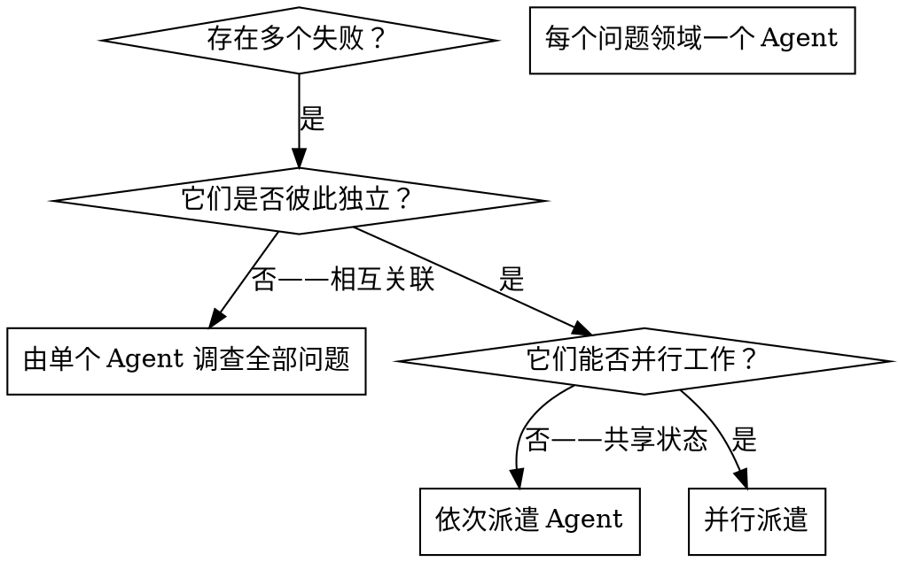

# 派遣并行 Agent

## 概述

你将任务委派给上下文相互隔离的专门 Agent。通过精确设计给它们的指令和上下文，你可以确保它们保持专注并成功完成任务。它们绝不应继承你的会话上下文或历史记录——你要准确构建它们所需的内容。这也能保留你自己的上下文，以便进行协调工作。

当你遇到多个互不相关的失败（不同的测试文件、不同的子系统、不同的 bug）时，依次调查它们会浪费时间。每项调查都彼此独立，可以并行进行。

**核心原则：** 每个独立的问题领域派遣一个 Agent。让它们并发工作。

## 何时使用



**适用情形：**
- 3 个以上测试文件因不同的根本原因而失败
- 多个子系统各自独立损坏
- 每个问题都能在不依赖其他问题上下文的情况下得到理解
- 各项调查之间不存在共享状态

**不适用情形：**
- 失败相互关联（修复一个可能会修复其他失败）
- 需要理解完整的系统状态
- Agent 之间会相互干扰

## 模式

### 1. 识别独立领域

按照损坏的部分对失败进行分组：
- 文件 A 测试：工具审批流程
- 文件 B 测试：批量完成行为
- 文件 C 测试：中止功能

每个领域都是独立的——修复工具审批不会影响中止测试。

### 2. 创建聚焦的 Agent 任务

每个 Agent 获得：
- **具体范围：** 一个测试文件或子系统
- **明确目标：** 让这些测试通过
- **约束：** 不要更改其他代码
- **预期输出：** 总结你发现并修复的内容

### 3. 并行分派

在同一条响应中发出全部三个子 Agent 分派——它们会并行运行：

```text
子 Agent (general-purpose): "修复 agent-tool-abort.test.ts 的失败"
子 Agent (general-purpose): "修复 batch-completion-behavior.test.ts 的失败"
子 Agent (general-purpose): "修复 tool-approval-race-conditions.test.ts 的失败"
# 三者并发运行。
```

一条响应中进行多次分派调用 = 并行执行。每条响应一次 = 顺序执行。

### 4. 审查并集成

当各 Agent 返回时：
- 阅读每份总结
- 验证各项修复不会冲突
- 运行完整测试套件
- 集成所有更改

## Agent 提示词结构

良好的 Agent 提示词应当：
1. **聚焦** - 一个明确的问题领域
2. **独立完备** - 包含理解问题所需的全部上下文
3. **明确说明输出** - Agent 应返回什么？

```markdown
修复 src/agents/agent-tool-abort.test.ts 中 3 个失败的测试：

1. "应在捕获部分输出的情况下中止工具" - 期望消息中包含 '中断于'
2. "应处理混合的已完成和已中止工具" - 快速工具被中止，而不是完成
3. "应正确跟踪 pendingToolCount" - 期望得到 3 个结果，但实际得到 0 个

这些是时序/竞态条件问题。你的任务：

1. 阅读测试文件并理解每个测试验证的内容
2. 找出根本原因 - 是时序问题还是实际缺陷？
3. 通过以下方式修复：
   - 用基于事件的等待替换任意超时
   - 如果发现中止实现中存在缺陷，则修复它们
   - 如果测试的是已变更的行为，则调整测试预期

不要只是增加超时时间 - 要找出真正的问题。

返回：你发现了什么以及修复了什么的摘要。
```

## 常见错误

**❌ 范围太宽泛：** "修复所有测试" - Agent 会迷失方向
**✅ 具体：** "修复 agent-tool-abort.test.ts" - 范围明确

**❌ 没有上下文：** "修复竞态条件" - Agent 不知道在哪里
**✅ 上下文：** 粘贴错误消息和测试名称

**❌ 无约束：** Agent 可能会重构所有内容
**✅ 约束：** "不要更改生产代码" 或 "只修复测试"

**❌ 模糊的输出：** "修复它" - 你不知道哪些内容发生了变化
**✅ 具体的输出：** "返回根本原因和所做更改的摘要"

## 何时不应使用

**相关的失败：** 修复一个可能会修复其他失败 - 先一起调查
**需要完整上下文：** 要理解问题，需要查看整个系统
**探索性调试：** 你还不知道哪里出了问题
**共享状态：** Agent 会相互干扰（编辑相同的文件、使用相同的资源）

## 会话中的真实示例

**场景：** 大规模重构后，3 个文件中出现 6 个测试失败

**失败：**
- agent-tool-abort.test.ts: 3 个失败（时序问题）
- batch-completion-behavior.test.ts: 2 个失败（工具未执行）
- tool-approval-race-conditions.test.ts: 1 个失败（执行次数 = 0）

**决策：** 各领域相互独立 - 中止逻辑、批次完成和竞态条件彼此分离

**分派：**
```
Agent 1 → 修复 agent-tool-abort.test.ts
Agent 2 → 修复 batch-completion-behavior.test.ts
Agent 3 → 修复 tool-approval-race-conditions.test.ts
```

**结果：**
- Agent 1：用基于事件的等待替换了超时
- Agent 2：修复了事件结构错误（threadId 位于错误的位置）
- Agent 3：添加了等待异步工具执行完成的逻辑

**集成：** 所有修复彼此独立，没有冲突，完整测试套件全部通过

**节省的时间：** 3 个问题并行解决，而非依次解决

## 主要优势

1. **并行化** - 多项调查同时进行
2. **专注** - 每个 Agent 的范围都很窄，需要跟踪的上下文更少
3. **独立性** - Agent 之间互不干扰
4. **速度** - 用解决 1 个问题的时间解决了 3 个问题

## 验证

Agent 返回后：
1. **审查每份总结** - 了解发生了哪些变更
2. **检查冲突** - Agent 是否编辑了相同的代码？
3. **运行完整测试套件** - 验证所有修复能否协同工作
4. **抽查** - Agent 可能会犯系统性错误

## 实际影响

来自调试会话（2025-10-03）：
- 3 个文件中共有 6 个失败
- 并行派遣了 3 个 Agent
- 所有调查均并发完成
- 所有修复均成功集成
- Agent 变更之间零冲突
