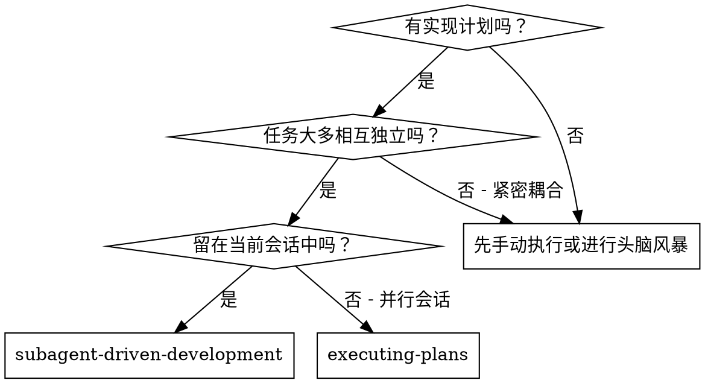
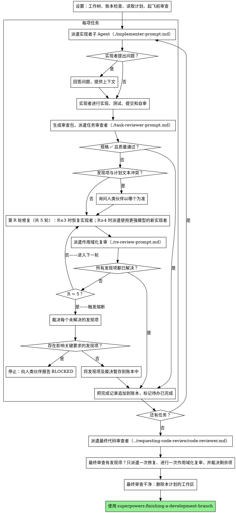

# 子 Agent 驱动的开发

通过为每项任务派遣一个全新的实现者子 Agent、在每项任务后进行一次任务审查（规格符合性 + 代码质量），并在最后对整个分支进行全面审查来执行计划。

**为什么使用子 Agent：** 你将任务委派给具有隔离上下文的专门 Agent。通过精确设计它们的指令和上下文，确保它们保持专注并成功完成各自的任务。它们绝不能继承你当前会话的上下文或历史记录——你只构建它们恰好所需的内容。这也会保留你自己的上下文，以用于协调工作。

**核心原则：** 每项任务使用全新的子 Agent + 任务审查（规格 + 质量）+ 全面的最终审查 = 高质量、快速迭代

**叙述：** 在工具调用之间，最多叙述一行简短内容——
记录由台账和工具结果承载。

**持续执行：** 不要在任务之间暂停下来向你的人类伙伴确认。不中断地执行计划中的所有任务。仅可因以下情况停止：出现你无法解决的 BLOCKED 状态、存在确实阻碍进展的歧义，或所有任务均已完成。询问“我应该继续吗？”以及提供进度摘要会浪费他们的时间——他们要求你执行计划，所以就执行它。

## 何时使用



**与执行计划（并行会话）的对比：**
- 同一会话（无需切换上下文）
- 每项任务使用全新的子 Agent（无上下文污染）
- 每项任务后都进行审查（规格符合性 + 代码质量），最后进行全面审查
- 更快的迭代（任务之间无需人类介入）

## 流程



## 设置

务必确保工作在隔离的工作区中进行：使用
superpowers:using-git-worktrees 创建一个工作区，或验证现有工作区。
未经你的人类伙伴明确同意，绝不要在 main/master 分支上开始实现。

对话记忆无法在压缩后保留。在真实会话中，忘记当前进度的
控制器曾重新分派整套已经完成的任务序列——这是观察到的代价
最高的单一故障。请在台账文件中跟踪进度，而不要仅依赖待办事项。

- 每个计划都拥有自己的工作区：技能启动时，运行本技能的
  `scripts/sdd-workspace PLAN_FILE`——它会输出该计划被 git 忽略的
  目录（`<repo-root>/.superpowers/sdd/<plan-basename>/`），本计划的
  所有产物都存放于此：台账、简报、报告、复审包。
  绝不得读取或写入另一个计划的目录。
- 检查此计划位于 `<workspace>/progress.md` 的台账。如果其第一行
  指明的是你的计划文件，则带有一行 `Task <N>: complete` 的任务均已完成
  ——不得重新分派它们；从第一个没有该行的任务继续。若某项任务的
  最后一行是一个修复轮次，则该任务正处于循环中：从下一轮继续该
  循环。如果台账的第一行指明的是另一个计划文件——或者旧的扁平路径
  `.superpowers/sdd/progress.md` 中存在一个遗留台账——那就是另一个
  计划的进度：将其留在原处，并从头新建你自己的台账。
- 创建台账，并将其身份信息写在第一行：
  `# SDD ledger — plan: <plan file path>`。
- 台账是你的恢复地图：其中记载的提交即使在你的上下文不再记得创建过
  它们时，也仍存在于 git 中。压缩后，相比你自己的回忆，应相信台账和
  `git log`。
- `git clean -fdx` 会摧毁该工作区（它是被 git 忽略的临时目录）；如果
  发生这种情况，请从 `git log` 恢复。

通读计划一次，记下其上下文和全局约束，并为每项任务创建一个
待办事项。

在分派任务 1 之前，通读计划一次以检查冲突：

- 彼此矛盾或与计划的全局约束相矛盾的任务
- 计划明确要求、但审查量规视为缺陷的任何事项（一个没有进行任何断言的
  测试、逐字重复一个逻辑块）

在执行开始前，将你发现的所有内容作为一个批量问题提交给你的人类伙伴——
将每项发现与要求该事项的计划文本并列，并询问以哪一项为准——而不是在
计划执行途中每发现一项就中断一次。如果检查未发现问题，则不作说明，继续
执行。对于只有在实现过程中才显现的冲突，复审循环仍是兜底机制。

## 模型选择

使用能够胜任各个角色的最低能力模型，以节省成本并提高速度。

**机械性实现任务**（孤立函数、明确的规范、1-2 个文件）：使用快速、廉价的模型。当计划规定得足够明确时，大多数实现任务都是机械性的。

**集成和判断任务**（多文件协调、模式匹配、调试）：使用标准模型。

**架构和设计任务**：使用当前可用的最强大模型。
整个分支的最终审查就属于此类——应将其派发给当前可用的最强大模型，而不是会话默认模型。

**审查任务**：以同样的判断标准选择模型，并根据差异的规模、复杂性和风险调整。小型机械性差异不需要最强大的模型；细微的并发变更则需要。对小型修复差异进行范围明确的复审时，使用廉价至中档模型。

**修复循环升级（第 4-5 轮）**：使用至少比陷入困境的实现者高一个档次的模型。

**派发子 Agent 时，始终明确指定模型。** 省略模型时，将继承你会话所用的模型——通常是最强大且最昂贵的模型——这会在不知不觉中违背本节的目的。

**轮次数比 token 单价更重要。** 实际耗时和上下文成本会随子 Agent 的轮次数量而增加，而最廉价的模型在多步骤工作中通常需要 2-3× 的轮次——导致总体成本更高。对于审查者以及根据文字描述开展工作的实现者，应至少使用中档模型。当任务的计划文本包含需要编写的完整代码时，实现工作就是誊写加测试：为该实现者使用最廉价档次的模型。单文件机械性修复也使用最廉价档次的模型。

**任务复杂度信号（实现任务）：**
- 涉及 1-2 个文件且规范完整 → 廉价模型
- 涉及多个文件且存在集成方面的考量 → 标准模型
- 需要设计判断或对代码库有广泛理解 → 最强大的模型

## 任务循环

你粘贴到派遣提示中的所有内容——以及子 Agent 返回的所有输出——在会话余下的整个期间都会常驻于你的上下文中，并在之后的每一轮中被重新读取。请以文件形式交接产物。

### 1. 派遣实现者

派遣前记录 BASE（`git rev-parse HEAD`）——审查包和修复轮次的 diff 都需要它。

- **任务简报：**派遣实现者之前，运行本技能的
  `scripts/task-brief PLAN_FILE N`——它会将任务的完整文本提取到一个具有唯一名称的文件中，并打印该路径。组织派遣内容时，应让简报始终作为需求的唯一来源。你的派遣内容应包含：(1) 用一行说明此任务在项目中的位置；(2) 简报路径，并以“先阅读此文件——它就是你的需求，其中包含必须原样使用的精确值”引出；(3) 简报不可能知道的、来自先前任务的接口和决策；(4) 你对简报中所注意到的任何歧义的解决方案；(5) 报告文件路径和报告约定。精确值（数字、魔法字符串、签名、测试用例）只能出现在简报中。绝不要让子 Agent 阅读整个计划文件。
- **报告文件：**以简报为实现者的报告文件命名（简报 `…/task-N-brief.md` → 报告 `…/task-N-report.md`），并将其写入派遣提示。实现者在该文件中写入完整报告，并且只返回状态、提交记录、一行测试摘要和关注事项。
- 一条派遣提示描述的是一个任务，而不是会话的历史。不要把累积的先前任务摘要（“任务 1-3 后的状态”）粘贴到后续派遣中——某个真实会话的派遣内容达到了 42k 个字符，其中 99% 都是粘贴的历史记录。一个全新的子 Agent 需要的是它的任务、它会涉及的接口以及全局约束。除此之外什么都不需要。
- 如果先前的任务在本任务涉及的区域中暂存了一项发现，请在派遣内容中附上指向该账本条目的指针。
- 从派遣结果中记录实现者的 Agent 身份——修复循环第 1-3 轮会恢复此 Agent。
- 绝不要并行派遣多个实现子 Agent（会产生冲突）。

模板：[implementer-prompt.md](implementer-prompt.md)

### 2. 处理报告

实现者子 Agent 会报告以下四种状态之一。请分别妥善处理：

**DONE:** 生成审查包（`scripts/review-package PLAN_FILE BASE HEAD`，从本技能的目录运行——它会输出其写入的唯一文件路径；BASE 是你在派遣实现者之前记录的提交——绝不能使用 `HEAD~1`，因为这会悄无声息地丢弃多提交任务中除最后一个提交之外的所有提交），然后使用输出的路径派遣任务审查者。

**DONE_WITH_CONCERNS:** 实现者完成了工作，但提出了一些疑虑。继续之前先阅读这些疑虑。如果疑虑涉及正确性或范围，请在审查之前解决。如果只是一些观察（例如，“这个文件变得越来越大了”），请记录下来并继续审查。

**NEEDS_CONTEXT:** 实现者需要尚未提供的信息。提供缺失的上下文并重新派遣。

**BLOCKED:** 实现者无法完成任务。评估阻碍因素：
1. 如果是上下文问题，请提供更多上下文，并使用同一模型重新派遣
2. 如果任务需要更多推理，请使用能力更强的模型重新派遣
3. 如果任务过大，请将其拆分成更小的部分
4. 如果计划本身有误，请上报给人类

**绝不**忽略上报，也绝不强迫同一模型在没有任何改变的情况下重试。如果实现者表示它卡住了，就必须做出改变。

如果实现者在开始之前或任务进行期间提出问题，请清晰、完整地回答，
在需要时提供额外的上下文，并且不要催促它仓促进入实现阶段。


### 3. 审查任务

逐任务审查是限定于任务范围的关卡。广泛审查只进行一次，即在最终的整个分支审查时进行。绝不要跳过任务审查，也绝不要接受缺少任一结论的报告——规范符合性和任务质量两者都必须具备。实现者自我审查绝不能取代任务审查；两者都必不可少。

- 将 diff 作为文件交给审查者：运行本技能的
  `scripts/review-package PLAN_FILE BASE HEAD`，并将它输出的文件路径传给审查者
  （或者，不使用 bash 时：针对该范围运行 `git log --oneline`、`git diff --stat`
  和 `git diff -U10`，并将输出重定向到一个名称唯一的
  文件）。该输出绝不会进入你自己的上下文，而审查者只需一次 Read
  调用就能看到提交列表、统计摘要以及带上下文的完整 diff。
  使用你在派遣实现者之前记录的 BASE——绝不要使用
  `HEAD~1`，因为它会悄无声息地截断包含多个提交的任务。绝不要
  在没有 diff 文件的情况下派遣任务审查者。
- **审查者输入：**任务审查者会获得三个路径——同一份简报
  文件、报告文件和审查包——以及约束该任务的全局
  约束。
- 你交给审查者的全局约束块是其关注问题的
  视角。逐字复制计划的“全局约束”部分或规范中具有约束力的
  要求：确切的值、确切的格式，以及明确说明的组件之间的
  关系（“与 X 布局相同”、“与 Y
  匹配”）。审查者的模板已经包含流程规则（YAGNI、
  测试卫生、审查方法）——约束块用于说明这个
  项目的规范要求什么。
- 不要添加诸如“检查所有使用处”或“如果有用就运行竞态测试”
  之类的开放式指令，除非有具体的、特定于任务的理由
- 不要让审查者重新运行实现者已在同一份代码上运行过的测试
  ——实现者的报告中包含测试证据
- 不要替审查者预判发现项——绝不要指示审查者
  忽略某个具体问题或不标记它。如果你认为某个发现项会是
  误报，就让审查者提出它，并在审查
  循环中对其作出裁定。如果你正在编写的提示包含“不要标记”、“不要将 X
  视为缺陷”、“至多为 Minor”或“计划选择了”——立即停止：你正在
  预判，通常是为了让自己省掉一轮审查循环。
任务审查者可能会报告“⚠️ 无法从 diff 验证”的事项——这些要求
存在于未更改的代码中或跨越多个任务。这些事项不会阻塞审查的
其余部分，但在将任务标记为完成之前，你必须自行解决每一项：
你掌握着审查者所缺少的计划和跨任务上下文。
如果你确认某项确实是缺口，就将其视为规范审查失败——它会与其他
发现项一同进入修复循环。

模板：[task-reviewer-prompt.md](task-reviewer-prompt.md)

### 4. 修复循环

当审查报告规格 ❌、任何严重或重要发现项，或你已确认为真实缺口的 ⚠️ 条目时，就会触发该循环。

在循环开始之前，有两条路径会立即退出该循环：

- 在推进过程中，将次要发现项记录到进度账本中
  （`Task <N>: minor (deferred): <one-liner>`），并让最终的全分支审查查看该列表，以便它判定其中哪些必须在合并前修复。无人阅读的汇总就是悄无声息的丢弃。次要发现项永不进入该循环。
- 标记为计划强制要求的发现项——或任何与计划文本要求冲突的发现项——都应像任何计划矛盾一样，由人类决定：展示该发现项和计划文本，并询问以哪一个为准。不要因为计划强制要求它就驳回该发现项，也不要在未询问的情况下派发与计划相冲突的修复。
其余一切都进入该循环。一轮修复包括一次修复派发，加上一次限定范围的复审。每个任务最多五轮：

**第 1-3 轮——恢复原实现者。** 将未解决的发现项逐字发送给它。它的上下文完好无损：它了解任务、代码以及它自己的选择。如果你的运行框架无法向仍在运行的子 Agent 再发送一条消息，则派发一个新的实现者，并向其提供简报路径、报告文件路径和这些发现项——无论哪种方式，报告文件都是持久记忆。

**第 4-5 轮——在能力更强的模型上派发一个新的实现者**（按照模型选择），并向其提供简报路径、报告文件路径、未解决的发现项，以及以下说明：“先前的一名实现者已尝试此任务 [N] 次；现在由你负责。阅读报告文件，了解已经尝试过什么。”一个经历三次恢复调用后仍未结束的循环，通常意味着实现者无法看出自己的问题——一次行动同时引入新的视角并提升能力。

**每一轮，无论是哪种情况：** 实现者进行修复，重新运行覆盖已修改代码的测试，将其修复报告追加到同一个报告文件中，并返回简短契约。在重新派发审查者之前，确认修复报告包含覆盖已修改代码的测试、所运行的命令和输出；三者全部具备后，再派发复审。在修复消息中列出覆盖测试文件的名称——单行修复不需要整个测试套件。

**复审是作用域化的。** 运行 `scripts/review-package PLAN_FILE FIX_BASE HEAD`，其中 FIX_BASE 是上一次审查所看到的提交头，并派发 [re-review-prompt.md](re-review-prompt.md)，同时提供发现项列表、简报、报告文件和打印出的 diff 路径。复审者将每个发现项裁定为 ADDRESSED 或 NOT ADDRESSED，并且只标记修复 diff 中的新破坏。修复 diff 中新的 Critical/Important 破坏会加入未解决的发现项列表。超出作用域的观察项会作为延期次要项记入账本——它们绝不会延长循环。

**每轮结束后，**向账本追加：
`Task <N>: fix round <R>/5 (<X> addressed, <Y> open — <finding one-liners>; commits <a7>..<b7>)`

绝不要在控制器会话中亲自修复发现项——你的上下文应保持干净以便协调，而控制器直接修复会跳过审查。

**熔断器。** 如果第 5 轮复审后仍有未解决的发现项，就停止派遣。由你亲自裁决每个未解决的发现项——你掌握审查者所缺少的计划和跨任务上下文：

- **审查者判断错误，或该问题存在争议：** 暂存它——
  `Task <N>: parked — <finding> — ruling: <why the code stands>`。最终审查会看到双方理由。
- **问题真实存在，但下游没有任何内容依赖它：** 以同样方式暂存，并在裁决中说明它确实存在但已延期。
- **问题真实存在且影响关键要求**——后续任务会依赖它，或它揭示了计划缺陷：停止。追加
  `Task <N>: BLOCKED — <reason>`，并向你的人类伙伴报告该发现项、与之冲突的计划文本以及修复历史。暂存结构性失败会让所有依赖任务继续在它之上构建，也会把一个最终审查同样无法修复的问题留到最后。

只在达到轮次上限时进行裁决。提前裁决来结束循环，不过是换了名称的预判。每次裁决都必须写入账本——严禁无声丢弃。

### 5. 完成任务

当审查结果无问题——或者在达到上限时，每个未关闭的发现项都已附裁定搁置——请在执行其他记账工作的同一条消息中，将完成行追加到账本：

- `Task <N>: complete (commits <base7>..<head7>, review clean)`
- 触发熔断器后使用 `Task <N>: complete (commits <base7>..<head7>, <K> parked)`

然后将待办事项标记为完成并继续。只要审查中仍有既未修复、也未在达到上限时附裁定搁置的未关闭 Critical/Important 问题，就绝不要进入下一个任务。

## 最终审查

最终的整分支审查也要有一个审查包：运行 `scripts/review-package PLAN_FILE MERGE_BASE HEAD`（MERGE_BASE = 该分支起始于的提交，例如 `git merge-base main HEAD`），并在派发最终审查时包含输出的路径，这样最终审查者只需读取一个文件，而不必使用 git 命令重新推导分支差异。使用最强的可用模型进行派发（参见模型选择），并使用 superpowers:requesting-code-review 的 [code-reviewer.md](../requesting-code-review/code-reviewer.md)。让它查看账本中的 deferred-minor 行和 parked 行，以便对哪些项目必须在合并前修复进行分诊。

如果最终的整分支审查返回发现项，请派发一个且仅一个修复子 Agent，并向其提供完整的发现项列表——不要为每个发现项分别派一个修复者。按发现项分别安排的修复者都要重建上下文并重新运行套件；在一次真实会话中，最终审查的修复波次成本超过了其所有任务的总和。然后，对该修复波次恰好进行一次限定范围的复审（针对修复范围运行 `scripts/review-package PLAN_FILE FIX_BASE HEAD`，[re-review-prompt.md](re-review-prompt.md)）。按照任务循环中的熔断器方式裁决任何残留发现项：附裁定搁置，或在遇到承重性发现项时停止。不存在第二个修复波次——当 finishing-a-development-branch 呈现选项时，残留的承重性发现项会提交给你的人类伙伴。

## 收尾

当最终的整分支审查无问题且其修复已合并后，删除此计划的工作区（`rm -rf <workspace>`）——现在 git 历史就是记录。同级目录属于其他计划；不要动它们。

使用 superpowers:finishing-a-development-branch。

## 常见合理化

| 借口 | 事实 |
|--------|---------|
| "规范符合度已经足够接近了" | 审查者发现规范缺口 = 尚未完成。修复它，或者达到上限并进行裁决——只有这两条出路。 |
| "我会自己修复，派发会增加开销" | 控制器进行修复会污染你的上下文并跳过审查。让实现者继续。 |
| "再来一轮就会收敛" | 超过上限后，各轮不会收敛——这种失败是结构性的。进行裁决并转交。 |
| "反正审查者还是会找到新的问题" | 限定范围的复审只验证修复；不得偏离范围。未改动代码上的新发现项应进入账本，而不是进入循环。 |
| "这个发现项显然是错的，我会丢弃它" | 你只能在达到上限时进行裁决，而且每项裁定都必须成为一条账本条目。禁止静默丢弃。 |
| "修复很小，跳过复审吧" | 未经审查的修复正是回归问题混入的方式。每一轮都以限定范围的复审结束。 |
| "审查会拖慢循环" | 没有审查的循环只不过是未经验证的反复折腾。审查是循环的刹车和方向盘。 |
| "账本记账是额外开销" | 账本是在压缩后仍能保留下来的东西。没有账本的控制器曾重新派发整个已完成的任务序列。 |

## 示例工作流

```
你：我正在使用子 Agent 驱动的开发来执行此计划。

[设置：已验证工作树]
[一次性读取计划文件：docs/superpowers/plans/feature-plan.md]
[解析工作区：scripts/sdd-workspace docs/superpowers/plans/feature-plan.md——其中没有账本，全新开始]
[为所有任务创建待办事项]

任务 1：Hook 安装脚本

[为任务 1 运行 task-brief；使用简报路径 + 报告路径 + 上下文派遣实现者]

实现者：“开始前确认一下——Hook 应安装在用户级还是系统级？”

你：“用户级（~/.config/superpowers/hooks/）”

实现者：[稍后]
  - 实现了 install-hook 命令
  - 添加了测试，5/5 通过
  - 自审：发现遗漏了 --force 标志，已添加
  - 已提交

[运行 review-package PLAN_FILE BASE HEAD；使用打印出的路径派遣任务审查者]
任务审查者：规格 ✅——满足全部要求，没有额外内容。
  优点：测试覆盖良好，代码干净。问题：无。任务质量：通过。

[账本：Task 1: complete (commits a1b2c3d..d4e5f6a, review clean)]

任务 2：恢复模式

[为任务 2 运行 task-brief；使用简报路径 + 报告路径 + 上下文派遣实现者]

实现者：[没有问题]
  - 添加了 verify/repair 模式
  - 8/8 测试通过
  - 已提交

[运行 review-package PLAN_FILE BASE HEAD；使用打印出的路径派遣任务审查者]
任务审查者：规格 ❌：
  - 缺少：进度报告（规格要求“每处理 100 项报告一次”）
  问题（重要）：魔法数字（100）

[第 1 轮修复：把两个发现项都发送给原实现者并恢复它]
实现者：添加了进度报告，提取出 PROGRESS_INTERVAL 常量。
  重新运行 test/recovery.test.js——10/10 通过。已追加修复报告。

[运行 review-package PLAN_FILE FIX_BASE HEAD；派遣作用域化复审]
复审者：缺少进度报告——已解决（src/recovery.js:41）。
  魔法数字——已解决（src/recovery.js:7）。新的破坏：无。
  结论：所有发现项均已解决。

[账本：Task 2: fix round 1/5 (2 addressed, 0 open; commits d4e5f6a..b7c8d9e)]
[账本：Task 2: complete (commits d4e5f6a..b7c8d9e, review clean)]

……

[所有任务完成后]
[运行 review-package PLAN_FILE MERGE_BASE HEAD；派遣使用最强模型的最终代码审查者]
最终审查者：满足全部要求。已分类延期的次要问题：没有阻碍合并的项目。

[删除本计划的工作区——记录现在保存在 git 中]

完成！正在使用 superpowers:finishing-a-development-branch。
```
