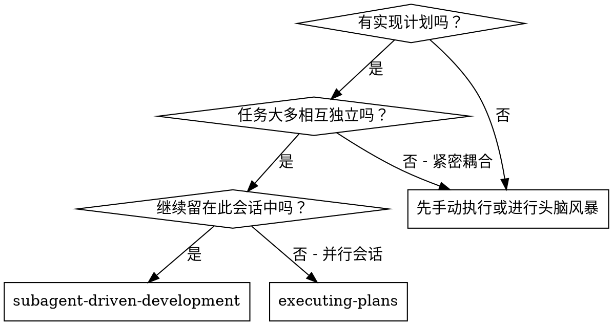
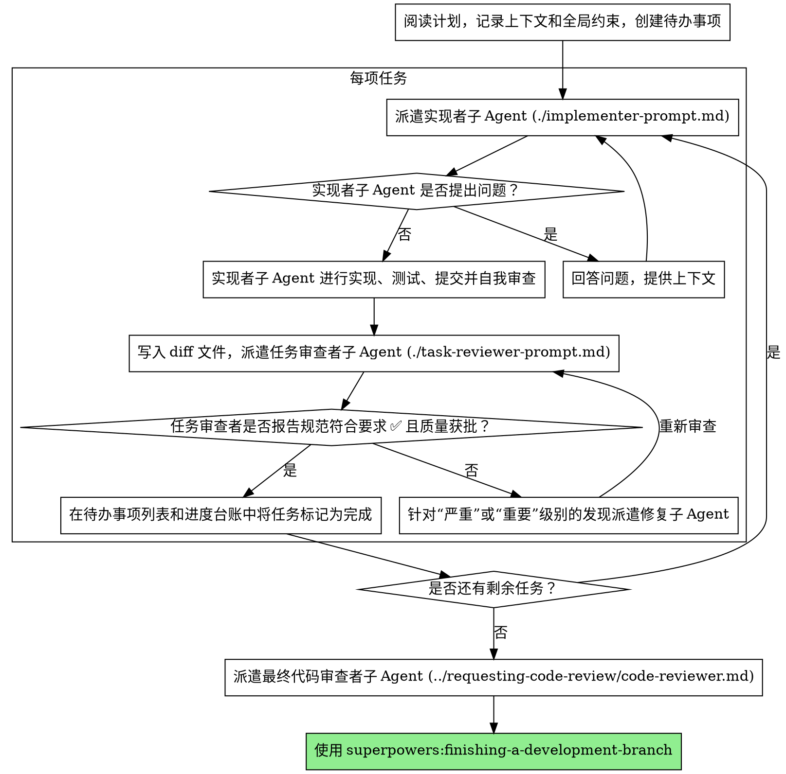

# 子 Agent 驱动的开发

通过为每个任务分派一个全新的实现者子 Agent 来执行计划，在每个任务完成后进行一次任务审查（规范符合性 + 代码质量），并在最后对整个分支进行全面审查。

**为什么使用子 Agent：** 你将任务委派给具有隔离上下文的专门 Agent。通过精确构建提供给它们的指令和上下文，你可以确保它们保持专注并成功完成任务。它们绝不应继承你当前会话的上下文或历史记录——你要准确构建它们所需的一切。这也会保留你自己的上下文，以用于协调工作。

**核心原则：** 每个任务使用全新的子 Agent + 任务审查（规范 + 质量）+ 全面的最终审查 = 高质量、快速迭代

**叙述：** 在工具调用之间，最多叙述一行简短内容——
台账和工具结果会承载记录。

**持续执行：** 不要在任务之间停下来向你的人类伙伴确认。不中断地执行计划中的所有任务。只有以下情况才可停止：出现你无法解决的 BLOCKED 状态、存在确实阻碍进展的歧义，或所有任务均已完成。“我应该继续吗？”之类的询问和进度摘要会浪费人类伙伴的时间——他们已经要求你执行计划，所以就执行它。

## 何时使用



**与 Executing Plans（并行会话）相比：**
- 同一会话（无需切换上下文）
- 每个任务使用全新的子 Agent（无上下文污染）
- 每个任务后进行审查（规范符合性 + 代码质量），最后进行全面审查
- 更快的迭代（任务之间无需人类介入）
## 流程



## 执行前计划审查

在派遣任务 1 之前，先通读一次计划以检查冲突：

- 相互矛盾或与计划的全局约束相冲突的任务
- 计划明确要求、但审查准则将其视为缺陷的任何内容
  （没有任何断言的测试、逐字重复的逻辑块）

在执行开始前，将你发现的所有内容作为一个批量问题呈现给你的人类伙伴——
每项发现都应与要求该项的计划文本并列，并询问应以哪一方为准——
而不是在计划执行中途每发现一项就打断一次。如果扫描未发现问题，
则不作说明并继续。审查循环仍是用于捕获那些只有在实现过程中
才显现的冲突的安全网。
## 模型选择

使用能够胜任各角色的能力最弱的模型，以节省成本并提高速度。

**机械性实现任务**（独立函数、明确的规格、1-2 个文件）：使用快速、便宜的模型。当计划定义得足够明确时，大多数实现任务都是机械性的。

**集成和判断任务**（多文件协调、模式匹配、调试）：使用标准模型。

**架构和设计任务**：使用能力最强的可用模型。
最终的整个分支审查就属于此类任务之一——应使用能力最强的可用模型来派发，而不是使用会话默认模型。

**审查任务**：选择具备同等判断能力，并与 diff 的规模、复杂度和风险相匹配的模型。小型机械性 diff 不需要能力最强的模型；微妙的并发变更则需要。

**派发子 Agent 时，始终显式指定模型。** 如果省略模型，就会继承会话所使用的模型——通常是能力最强且最昂贵的模型——这会悄无声息地违背本节要求。

**轮次数比 token 单价更重要。** 实际耗时和上下文成本会随子 Agent 所需的轮次数增加，而最便宜的模型在多步骤工作中通常需要 2-3 倍的轮次——导致总体成本反而更高。对于审查者，以及根据自然语言描述开展工作的实现者，至少使用中档模型。当任务计划文本包含需要编写的完整代码时，实现工作就是誊写加测试：该实现者应使用最便宜的档位。单文件机械性修复也使用最便宜的档位。

**任务复杂度信号（实现任务）：**
- 涉及 1-2 个文件且规格完整 → 便宜模型
- 涉及多个文件且存在集成问题 → 标准模型
- 需要设计判断或对代码库有广泛理解 → 能力最强的模型

## 处理实现者状态

实现者子 Agent 会报告以下四种状态之一。应根据每种状态进行恰当处理：

**DONE:** 生成审查包（在此技能的目录中运行 `scripts/review-package BASE HEAD`——它会打印自己写入的唯一文件路径；BASE 是派发实现者之前记录的提交——绝不能使用 `HEAD~1`，因为它会悄无声息地丢弃多提交任务中除最后一次提交之外的所有提交），然后使用打印出的路径派发任务审查者。

**DONE_WITH_CONCERNS:** 实现者已完成工作，但提出了疑虑。继续之前先阅读这些疑虑。如果疑虑与正确性或范围有关，应在审查前解决。如果只是观察意见（例如，“这个文件越来越大了”），则记录下来并继续进行审查。

**NEEDS_CONTEXT:** 实现者需要尚未提供的信息。提供缺失的上下文并重新派发。

**BLOCKED:** 实现者无法完成任务。评估阻塞原因：
1. 如果是上下文问题，提供更多上下文，并使用同一模型重新派发
2. 如果任务需要更强的推理能力，使用能力更强的模型重新派发
3. 如果任务过大，将其拆分成更小的部分
4. 如果计划本身有误，上报给人类

**绝不要**忽略升级请求，也不要在不作任何改变的情况下强迫同一模型重试。如果实现者表示自己卡住了，就必须做出改变。
## 处理审查者的 ⚠️ 项

任务审查者可能会报告“⚠️ 无法从差异中验证”项——这些要求
存在于未更改的代码中或跨越多个任务。这些项不会阻塞审查的其余部分，
但在将任务标记为完成之前，你必须自行解决每一项：你掌握着审查者
所缺少的计划和跨任务上下文。如果你确认某一项确实是缺口，请将其视为
规格审查失败——将其发回给实现者并重新审查。

## 构建审查者提示词

每任务审查是任务范围内的门禁。全面审查只在最终全分支审查时
进行一次。当你填写审查者模板时：

- 不要添加诸如“检查所有用法”或“如果有用就运行竞态测试”
  之类的开放式指令，除非有具体且针对该任务的理由
- 不要要求审查者在同一份代码上重新运行实现者已经运行过的测试——
  实现者的报告已提供测试证据
- 不要替审查者预判发现项——绝不要指示审查者忽略或不标记某个
  特定问题。如果你认为某个发现项会是误报，就让审查者提出它，并在
  审查循环中裁决。如果你正在编写的提示词包含“不要标记”、“不要将 X
  视为缺陷”、“最高为次要”或“计划选择了”——停下：你正在
  预判，通常是为了让自己免去一轮审查。
- 你交给审查者的全局约束块是其关注视角。逐字复制计划的“全局约束”
  部分或规格中的约束性要求：精确值、精确格式，以及所述的组件间关系
  （“与 X 布局相同”、“与 Y 匹配”）。审查者的模板已经包含流程规则
  （YAGNI、测试卫生规范、审查方法）——约束块用于说明这个特定项目的
  规格所要求的内容。
- 以文件形式将差异交给审查者：运行此技能的
  `scripts/review-package BASE HEAD`，并把它输出的文件路径
  传给审查者（或者在没有 bash 时：对该范围运行 `git log --oneline`、
  `git diff --stat` 和 `git diff -U10`，并将输出重定向到一个名称唯一的
  文件）。输出绝不会进入你自己的上下文，而审查者只需一次 Read
  调用，就能看到提交列表、统计摘要以及带上下文的完整差异。使用你在
  派遣实现者之前记录的 BASE——绝不要使用 `HEAD~1`，它会悄无声息地
  截断包含多个提交的任务。
- 派遣提示词描述的是一个任务，而不是会话历史。不要把累积的先前任务
  摘要（“任务 1-3 后的状态”）粘贴到后续派遣中——一次真实会话的派遣
  提示词达到了 42k 个字符，其中 99% 都是粘贴的历史记录。一个新的
  子 Agent 需要的是它的任务、它所涉及的接口以及全局约束，仅此而已。
- 针对“严重”和“重要”发现项派遣修复子 Agent。过程中将“次要”
  发现项记录到进度账本中，并让最终全分支审查关注该列表，以便评估
  哪些必须在合并前修复。无人阅读的汇总就是无声的丢弃。
- 被标记为 plan-mandated 的发现项——或任何与计划文本要求冲突的发现项——
  与任何计划矛盾一样，都应由人类决定：展示该发现项和计划文本，并询问
  以哪一个为准。不要因为计划规定了它就驳回该发现项，也不要在未询问的
  情况下派遣会产生与计划冲突结果的修复。
- 最终全分支审查也要获得一个包：运行
  `scripts/review-package MERGE_BASE HEAD`（MERGE_BASE = 分支起始的
  提交，例如 `git merge-base main HEAD`），并在最终审查派遣中包含
  输出的路径，使最终审查者读取一个文件，而不是使用 git 命令重新推导
  分支差异。
- 每次修复派遣都包含实现者契约：修复子 Agent 要重新运行覆盖其更改的
  测试并报告结果。在派遣中指明覆盖该更改的测试文件——单行修复不需要
  运行整个测试套件。在重新派遣审查者之前，确认修复报告包含覆盖性测试、
  运行的命令和输出；三者全部具备后再派遣重新审查。
- 如果最终全分支审查返回发现项，只派遣一个修复子 Agent，并向其提供
  完整的发现项列表——不要为每个发现项分别派遣一个修复者。逐项派遣的
  修复者都会各自重建上下文并重新运行测试套件；一次真实会话的最终审查
  修复波次耗费的成本超过了其所有任务的总和。
## 文件交接

你粘贴到派发提示词中的所有内容——以及子 Agent
打印返回的所有内容——都会在会话剩余期间常驻于你的上下文中，
并在此后的每一轮中被重新读取。请以文件形式交接产物：

- **任务简报：**在派发实现者之前，运行此技能的
  `scripts/task-brief PLAN_FILE N`——它会将任务的完整文本提取到一个
  具有唯一名称的文件中，并打印其路径。编写派发提示词时，应让该
  简报始终作为需求的唯一来源。你的派发提示词应包含：(1) 用一行说明此任务在项目中的位置；(2)
  简报路径，并以“先阅读此文件——它就是你的需求，其中包含必须
  原样使用的精确值”引出；(3) 简报无法获知的、来自先前任务的接口和决策；(4) 你对
  简报中任何已发现歧义的裁定；(5) 报告文件路径和
  报告约定。精确值（数字、魔法字符串、签名、测试
  用例）只出现在简报中。
- **报告文件：**按照简报命名实现者的报告文件
  （简报 `…/task-N-brief.md` → 报告 `…/task-N-report.md`），并将其写入
  派发提示词。实现者在该文件中写入完整报告，
  且仅返回状态、提交、一行测试摘要和关注事项。
- **审查者输入：**任务审查者会获得三个路径——同一个简报
  文件、报告文件和审查包——以及约束该任务的全局
  约束。
- 修复任务的派发会将其修复报告（包括测试结果）追加到同一个
  报告文件中，并返回简短摘要；重新审查时读取更新后的文件。

## 持久化进度

对话记忆无法在压缩后保留。在真实会话中，
丢失进度位置的控制器曾重新派发整组已完成的任务
序列——这是已观察到的代价最高的单一故障。请在
账本文件中跟踪进度，而不应只在待办事项中跟踪。

- 技能启动时，检查是否存在账本：
  `cat "$(git rev-parse --show-toplevel)/.superpowers/sdd/progress.md"`。其中列为
  已完成的任务均为 DONE——不要重新派发它们；从第一个
  未标记为已完成的任务继续。
- 当某项任务的审查结果无问题时，在进行其他记录工作的同一条消息中，向账本追加一行：
  `任务 N：已完成（提交 <base7>..<head7>，审查无问题）`。
- 账本是你的恢复地图：其中列出的提交存在于 git 中，即使
  你的上下文已不再记得创建过它们。压缩后，
  应信任账本和 `git log`，而不是你自己的回忆。
- `git clean -fdx` 会销毁账本（它是被 git 忽略的临时文件）；如果
  发生这种情况，请从 `git log` 恢复。
## 提示词模板

- [implementer-prompt.md](implementer-prompt.md) - 派遣实现者子 Agent
- [task-reviewer-prompt.md](task-reviewer-prompt.md) - 派遣任务审查子 Agent（规格符合性 + 代码质量）
- 最终全分支审查：使用 superpowers:requesting-code-review 的 [code-reviewer.md](../requesting-code-review/code-reviewer.md)

## 工作流示例

```
你：我正在使用子 Agent 驱动开发来执行此计划。

[读取一次计划文件：docs/superpowers/plans/feature-plan.md]
[为所有任务创建待办事项]

任务 1：钩子安装脚本

[为任务 1 运行 task-brief；携带简报 + 报告路径 + 上下文派遣实现者]

实现者：“在我开始之前——钩子应该安装在用户级还是系统级？”

你：“用户级（~/.config/superpowers/hooks/）”

实现者：“明白。现在开始实现...”
[稍后] 实现者：
  - 实现了 install-hook 命令
  - 添加了测试，5/5 通过
  - 自我审查：发现遗漏了 --force 标志，已添加
  - 已提交

[运行 review-package，携带打印出的路径派遣任务审查者]
任务审查者：规格 ✅ - 满足所有要求，没有额外内容。
  优点：测试覆盖良好，代码简洁。问题：无。任务质量：通过。

[将任务 1 标记为完成]

任务 2：恢复模式

[为任务 2 运行 task-brief；携带简报 + 报告路径 + 上下文派遣实现者]

实现者：[没有问题，继续执行]
实现者：
  - 添加了 verify/repair 模式
  - 8/8 测试通过
  - 自我审查：一切良好
  - 已提交

[运行 review-package，携带打印出的路径派遣任务审查者]
任务审查者：规格 ❌：
  - 缺失：进度报告（规格要求“每 100 个项目报告一次”）
  - 额外：添加了 --json 标志（未要求）
  问题（重要）：魔法数字（100）

[派遣修复子 Agent，并提供所有发现的问题]
修复者：移除了 --json 标志，添加了进度报告，提取了 PROGRESS_INTERVAL 常量

[任务审查者再次审查]
任务审查者：规格 ✅。任务质量：通过。

[将任务 2 标记为完成]

...

[所有任务完成后]
[派遣最终 code-reviewer]
最终审查者：所有要求均已满足，可以合并

完成！
```
## 优势

**与手动执行相比：**
- 子 Agent 会自然地遵循 TDD
- 每个任务都有全新的上下文（不会混淆）
- 可安全并行（子 Agent 互不干扰）
- 子 Agent 可以提问（工作开始前以及工作期间都可以）

**与 Executing Plans 相比：**
- 同一会话（无需交接）
- 持续推进（无需等待）
- 自动设置审查检查点

**效率提升：**
- 控制器精确筛选所需的上下文；大体量产物以文件形式传递，
  而不是粘贴文本
- 子 Agent 一开始就能获得完整信息
- 在工作开始前提出问题（而不是开始后）

**质量关卡：**
- 自我审查会在交接前发现问题
- 任务审查包含两项结论：规范符合性和代码质量
- 审查循环确保修复确实有效
- 规范符合性可防止过度构建或构建不足
- 代码质量可确保实现足够完善

**成本：**
- 需要更多次子 Agent 调用（每个任务都需要实现者 + 审查者）
- 控制器需要做更多准备工作（预先提取所有任务）
- 审查循环会增加迭代次数
- 但能及早发现问题（比之后调试更便宜）

## 红旗项

**绝不要：**
- 未经用户明确同意就在 main/master 分支上开始实现
- 跳过任务审查，或接受缺少任一结论的报告（规范符合性和任务质量两者均为必需）
- 在问题尚未修复时继续推进
- 并行派遣多个实现子 Agent（会发生冲突）
- 让子 Agent 阅读整个计划文件（应把它的任务简报——
  `scripts/task-brief`——交给它）
- 跳过背景铺垫上下文（子 Agent 需要理解任务在整体中的位置）
- 忽略子 Agent 的问题（先回答，再让它们继续）
- 在规范符合性上接受“差不多就行”（审查者发现规范问题 = 尚未完成）
- 跳过审查循环（审查者发现问题 = 实现者修复 = 再次审查）
- 让实现者的自我审查取代实际审查（两者都需要）
- 在派遣提示中告诉审查者哪些问题不要标记，或预先评定某项发现的严重程度
  （“最多将其视为次要”）——计划中的示例代码只是
  起点，并不能证明其中的弱点是有意选择的
- 在没有 diff 文件的情况下派遣任务审查者——先生成该文件
  （`scripts/review-package BASE HEAD`），并在提示中写明其输出的路径
- 在审查仍有未解决的“严重”或“重要”问题时转到下一个任务
- 重新派遣进度台账中已标记为完成的任务——在任何上下文压缩或恢复后，
  检查台账（以及 `git log`）

**如果子 Agent 提出问题：**
- 清晰、完整地回答
- 如有需要，提供额外上下文
- 不要催促它们开始实现

**如果审查者发现问题：**
- 由实现者（同一个子 Agent）修复
- 审查者再次审查
- 重复此过程，直至获批
- 不要跳过复审

**如果子 Agent 未能完成任务：**
- 派遣修复子 Agent，并提供具体指示
- 不要尝试手动修复（会污染上下文）
## 集成

**必需的工作流技能：**
- **superpowers:using-git-worktrees** - 确保工作区隔离（创建工作树或验证现有工作树）
- **superpowers:writing-plans** - 创建本技能所执行的计划
- **superpowers:requesting-code-review** - 用于最终整个分支审查的代码审查模板
- **superpowers:finishing-a-development-branch** - 在所有任务完成后完成开发工作

**子 Agent 应使用：**
