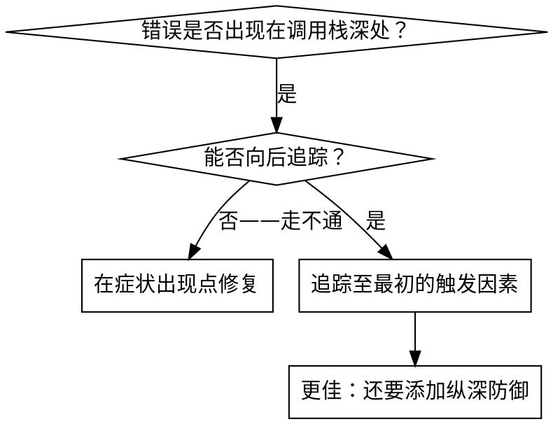
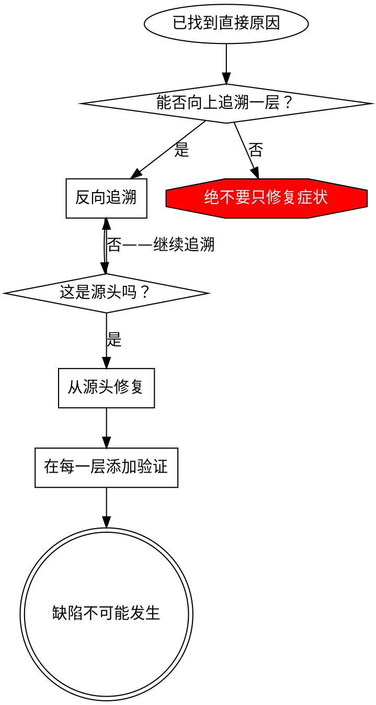

# 根因追踪

## 概述

错误通常会在调用栈深处显现（在错误的目录中执行 git init、在错误的位置创建文件、使用错误的路径打开数据库）。你的本能反应是在错误显现之处进行修复，但这只是在处理症状。

**核心原则：** 沿调用链向后追踪，直到找到最初的触发因素，然后从源头进行修复。

## 何时使用



**在以下情况下使用：**
- 错误发生在执行过程深处（而非入口点）
- 堆栈跟踪显示出很长的调用链
- 不清楚无效数据源自何处
- 需要找出是哪个测试/代码触发了问题

## 追踪过程

### 1. 观察症状
```
错误：git init 在 ~/project/packages/core 中失败
```

### 2. 找到直接原因
**什么代码直接导致了这一问题？**
```typescript
await execFileAsync('git', ['init'], { cwd: projectDir });
```

### 3. 追问：是什么调用了它？
```typescript
WorktreeManager.createSessionWorktree(projectDir, sessionId)
  → 由 Session.initializeWorkspace() 调用
  → 由 Session.create() 调用
  → 由测试在 Project.create() 处调用
```

### 4. 继续向上追踪
**传入了什么值？**
- `projectDir = ''`（空字符串！）
- 空字符串作为 `cwd` 时会解析为 `process.cwd()`
- 那就是源代码目录！

### 5. 找到最初的触发因素
**空字符串来自哪里？**
```typescript
const context = setupCoreTest(); // 返回 { tempDir: '' }
Project.create('name', context.tempDir); // 在 beforeEach 之前访问！
```

## 添加堆栈跟踪
当你无法手动追踪时，请添加检测代码：

```typescript
// 在有问题的操作之前
async function gitInit(directory: string) {
  const stack = new Error().stack;
  console.error('DEBUG git init:', {
    directory,
    cwd: process.cwd(),
    nodeEnv: process.env.NODE_ENV,
    stack,
  });

  await execFileAsync('git', ['init'], { cwd: directory });
}
```

**关键：** 在测试中使用 `console.error()`（不要使用 logger——它可能不会显示）

**运行并捕获：**
```bash
npm test 2>&1 | grep 'DEBUG git init'
```

**分析堆栈跟踪：**
- 查找测试文件名
- 找到触发调用的行号
- 识别规律（同一个测试？同一个参数？）

## 查找导致污染的测试

如果某些内容在测试期间出现，但你不知道是哪个测试导致的：

使用此目录中的二分查找脚本 `find-polluter.sh`：

```bash
./find-polluter.sh '.git' 'src/**/*.test.ts'
```

逐个运行测试，在发现第一个污染源时停止。用法请参见脚本。

## 真实示例：空的 projectDir
**症状：** 在 `packages/core/`（源代码）中创建了 `.git`

**追溯链：**
1. `git init` 在 `process.cwd()` 中运行 ← cwd 参数为空
2. 调用 WorktreeManager 时传入了空的 projectDir
3. 向 Session.create() 传入了空字符串
4. 测试在 beforeEach 之前访问了 `context.tempDir`
5. setupCoreTest() 最初返回 `{ tempDir: '' }`

**根本原因：** 顶层变量初始化时访问了空值

**修复：** 将 tempDir 改为一个 getter，若在 beforeEach 之前访问它就会抛出异常

**还添加了纵深防御：**
- 第 1 层：Project.create() 验证目录
- 第 2 层：WorkspaceManager 验证其非空
- 第 3 层：NODE_ENV 守卫拒绝在 tmpdir 之外执行 git init
- 第 4 层：在 git init 之前记录堆栈跟踪

## 关键原则



**绝不要只在错误出现的位置修复。** 反向追溯以找到最初的触发因素。

## 堆栈跟踪技巧

**在测试中：** 使用 `console.error()`，而不是 logger——logger 可能会被屏蔽
**在操作之前：** 在危险操作之前记录日志，而不是在其失败之后
**包含上下文：** 目录、cwd、环境变量、时间戳
**捕获堆栈：** `new Error().stack` 会显示完整的调用链

## 实际影响

来自调试会话（2025-10-03）：
- 通过 5 级追溯找到了根本原因
- 从源头修复（getter 验证）
- 添加了 4 层防御
- 1847 项测试通过，零污染
