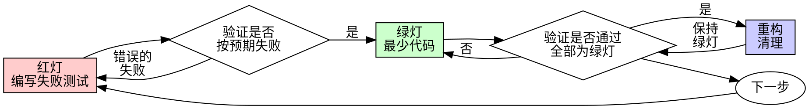

# 测试驱动开发（TDD）

## 概述

先编写测试。看着它失败。编写使其通过所需的最少代码。

**核心原则：** 如果你没有亲眼看到测试失败，你就不知道它是否测试了正确的内容。

**违反规则的字面要求，就是违反规则的精神。**

## 何时使用

**始终使用：**
- 新功能
- 错误修复
- 重构
- 行为变更

**例外情况（询问你的人类伙伴）：**
- 一次性原型
- 生成的代码
- 配置文件

在想“就这一次跳过 TDD”？停下。这是在合理化。

## 铁律

```
没有先失败的测试，就不得编写生产代码
```

在测试之前编写了代码？删除它。重新开始。

**没有例外：**
- 不要将它作为“参考”保留
- 不要在编写测试时“改编”它
- 不要查看它
- 删除就是删除

从测试出发重新实现。就这样。

## 红-绿-重构


### 红灯 - 编写失败测试

编写一个最小测试，展示应发生什么。

<Good>
```typescript
test('失败的操作重试 3 次', async () => {
  let attempts = 0;
  const operation = () => {
    attempts++;
    if (attempts < 3) throw new Error('失败');
    return 'success';
  };

  const result = await retryOperation(operation);

  expect(result).toBe('success');
  expect(attempts).toBe(3);
});
```
名称清晰，测试真实行为，只测试一件事
</Good>

<Bad>
```typescript
test('重试有效', async () => {
  const mock = jest.fn()
    .mockRejectedValueOnce(new Error())
    .mockRejectedValueOnce(new Error())
    .mockResolvedValueOnce('success');
  await retryOperation(mock);
  expect(mock).toHaveBeenCalledTimes(3);
});
```
名称含糊，测试的是 mock 而不是代码
</Bad>

**要求：**
- 单一行为
- 名称清晰
- 真实代码（除非不可避免，否则不使用 mock）

### 验证红灯 - 观察它失败
**强制要求。绝不跳过。**

```bash
npm test path/to/test.test.ts
```

确认：
- 测试失败（而不是报错）
- 失败消息符合预期
- 失败是因为功能缺失（而不是拼写错误）

**测试通过了？** 你测试的是现有行为。修正测试。

**测试报错了？** 修正错误，重新运行，直到测试正确地失败。

### GREEN - 最小代码

编写能让测试通过的最简单代码。

<Good>
```typescript
async function retryOperation<T>(fn: () => Promise<T>): Promise<T> {
  for (let i = 0; i < 3; i++) {
    try {
      return await fn();
    } catch (e) {
      if (i === 2) throw e;
    }
  }
  throw new Error('不可达');
}
```
恰好足以通过
</Good>

<Bad>
```typescript
async function retryOperation<T>(
  fn: () => Promise<T>,
  options?: {
    maxRetries?: number;
    backoff?: 'linear' | 'exponential';
    onRetry?: (attempt: number) => void;
  }
): Promise<T> {
  // 你不会需要它（YAGNI）
}
```
过度设计
</Bad>

不要添加功能、重构其他代码，也不要做超出测试要求的“改进”。

### 验证 GREEN - 亲眼看它通过

**强制要求。**

```bash
npm test path/to/test.test.ts
```

确认：
- 测试通过
- 其他测试仍然通过
- 输出干净无瑕（没有错误、警告）

**测试失败了？** 修正代码，而不是测试。

**其他测试失败了？** 立即修正。

### REFACTOR - 清理

仅在 GREEN 之后：
- 消除重复
- 改进命名
- 提取辅助函数

保持测试通过。不要添加行为。

### 重复

为下一个功能编写下一个失败测试。

## 好测试
| 质量 | 好 | 差 |
|---------|------|-----|
| **最小化** | 一件事。名称里有“和”？拆开它。 | `test('验证电子邮件、域和空白字符')` |
| **清晰** | 名称描述行为 | `test('test1')` |
| **体现意图** | 展示期望的 API | 掩盖代码应做什么 |

## 为什么顺序很重要

**“我会在之后编写测试来验证它是否有效”**

代码写完后再编写的测试会立即通过。立即通过证明不了任何事情：
- 可能测试了错误的内容
- 可能测试的是实现，而不是行为
- 可能遗漏你忘记的边界情况
- 你从未看到它捕获缺陷

测试先行会迫使你看到测试失败，从而证明它确实测试了某些内容。

**“我已经手动测试了所有边界情况”**

手动测试是临时随意的。你以为自己测试了所有内容，但是：
- 没有关于测试内容的记录
- 代码变更时无法重新运行
- 在压力下很容易忘记某些情况
- “我试的时候它能用” ≠ 全面测试

自动化测试是系统化的。它们每次都以相同方式运行。

**“删除 X 小时的工作成果是一种浪费”**

沉没成本谬误。时间已经花掉了。你现在的选择是：
- 删除并使用 TDD 重写（再花 X 小时，信心高）
- 保留它并在之后添加测试（30 分钟，信心低，很可能有缺陷）

真正的“浪费”是保留你无法信任的代码。没有真正测试的可运行代码就是技术债务。

**“TDD 很教条，务实意味着灵活应变”**

TDD 本身就是务实的：
- 在提交前发现缺陷（比事后调试更快）
- 防止回归（测试会立即捕获破坏）
- 记录行为（测试展示如何使用代码）
- 支持重构（可以自由修改，测试会捕获破坏）

“务实的”捷径 = 在生产环境中调试 = 更慢。

**“事后测试能实现相同的目标——重要的是精神，而不是仪式”**

不。事后测试回答“这做了什么？”测试先行回答“这应该做什么？”

事后测试会受到你的实现的影响。你测试的是自己构建的内容，而不是需求所要求的内容。你验证的是自己记得的边界情况，而不是发现的边界情况。

测试先行会迫使你在实现之前发现边界情况。事后测试验证的是你是否记住了所有内容（你没有）。

事后编写 30 分钟的测试 ≠ TDD。你获得了覆盖率，却失去了测试确实有效的证明。

## 常见合理化借口
| 借口 | 现实 |
|--------|---------|
| “太简单了，不值得测试” | 简单的代码也会出错。测试只需 30 秒。 |
| “我之后再测试” | 测试立即通过什么也证明不了。 |
| “事后测试也能达到相同目标” | 事后测试 = “这是做什么的？” 测试先行 = “这应该做什么？” |
| “已经手动测试过了” | 临时测试 ≠ 系统化测试。没有记录，无法重新运行。 |
| “删除 X 小时的成果太浪费了” | 沉没成本谬误。保留未经验证的代码就是技术债务。 |
| “保留作为参考，先写测试” | 你会改编它。那就是事后测试。删除就是删除。 |
| “需要先探索” | 可以。丢弃探索成果，从 TDD 开始。 |
| “测试很难 = 设计不清晰” | 倾听测试。难以测试 = 难以使用。 |
| “TDD 会拖慢我的速度” | TDD 比调试更快。务实 = 测试先行。 |
| “手动测试更快” | 手动测试无法证明边缘情况。每次变更后你都得重新测试。 |
| “现有代码没有测试” | 你正在改进它。为现有代码添加测试。 |

## 红旗项——停止并从头开始

- 先写代码，后写测试
- 实现后才写测试
- 测试立即通过
- 无法解释测试为什么失败
- “稍后”添加测试
- 为“仅此一次”找理由
- “我已经手动测试过了”
- “事后测试也能达到相同目的”
- “重要的是精神，而不是仪式”
- “保留作为参考”或“改编现有代码”
- “已经花了 X 小时，删除太浪费了”
- “TDD 太教条了，我是在务实行事”
- “这次不一样，因为……”

**所有这些都意味着：删除代码。使用 TDD 从头开始。**

## 示例：错误修复
**缺陷：** 接受空电子邮件地址

**红灯**
```typescript
test('拒绝空电子邮件地址', async () => {
  const result = await submitForm({ email: '' });
  expect(result.error).toBe('电子邮件为必填项');
});
```

**验证红灯**
```bash
$ npm test
FAIL: 预期为 '电子邮件为必填项'，实际得到 undefined
```

**绿灯**
```typescript
function submitForm(data: FormData) {
  if (!data.email?.trim()) {
    return { error: '电子邮件为必填项' };
  }
  // ...
}
```

**验证绿灯**
```bash
$ npm test
PASS
```

**重构**
如有需要，提取针对多个字段的验证逻辑。

## 验证清单
在将工作标记为完成之前：

- [ ] 每个新函数/方法都有测试
- [ ] 在实现之前亲眼看到每个测试失败
- [ ] 每个测试都因预期原因而失败（功能缺失，而非拼写错误）
- [ ] 编写了使每个测试通过所需的最少代码
- [ ] 所有测试均通过
- [ ] 输出干净无瑕（无错误、无警告）
- [ ] 测试使用真实代码（仅在无法避免时使用模拟对象）
- [ ] 已覆盖边界情况和错误

无法勾选所有复选框？你跳过了 TDD。重新开始。

## 遇到困难时

| 问题 | 解决方案 |
|---------|----------|
| 不知道如何测试 | 写出期望的 API。先写断言。询问你的人类伙伴。 |
| 测试过于复杂 | 设计过于复杂。简化接口。 |
| 必须模拟所有东西 | 代码耦合过紧。使用依赖注入。 |
| 测试设置过于庞大 | 提取辅助函数。仍然复杂？简化设计。 |

## 调试集成

发现缺陷？编写一个能够复现它的失败测试。遵循 TDD 循环。测试可证明修复有效并防止回归。

绝不要在没有测试的情况下修复缺陷。

## 测试反模式

添加模拟对象或测试工具时，请阅读 [testing-anti-patterns.md](testing-anti-patterns.md)，以避免常见陷阱：
- 测试模拟行为而非真实行为
- 向生产类添加仅供测试使用的方法
- 在不了解依赖关系的情况下进行模拟

## 最终规则

```
生产代码 → 测试已存在且先失败过
否则 → 不是 TDD
```

未经你的人类伙伴许可，不得有任何例外。
