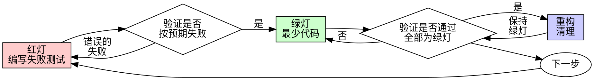

# 测试驱动开发（TDD）

## 概述

先编写测试。亲眼看它失败。再编写使其通过所需的最少代码。

**核心原则：** 如果你没有亲眼看到测试失败，就不知道它是否测试了正确的内容。

**违反规则的字面要求，就是违反规则的精神。**

## 何时使用

**始终使用：**
- 新功能
- 错误修复
- 重构
- 行为变更

**例外情况（询问你的人类伙伴）：**
- 一次性原型
- 生成的代码
- 配置文件

在想“就这一次跳过 TDD”？停下。这是在合理化。

## 铁律

```
没有先失败的测试，就不得编写生产代码
```

在测试之前编写了代码？删除它。重新开始。

**没有例外：**
- 不要将它作为“参考”保留
- 不要在编写测试时“改编”它
- 不要查看它
- 删除就是删除

从测试出发重新实现。就这样。

## 红-绿-重构



### RED - 编写失败测试

编写一个最小测试，展示应该发生什么。

<Good>
```typescript
test('retries failed operations 3 times', async () => {
  let attempts = 0;
  const operation = () => {
    attempts++;
    if (attempts < 3) throw new Error('fail');
    return 'success';
  };

  const result = await retryOperation(operation);

  expect(result).toBe('success');
  expect(attempts).toBe(3);
});
```
名称清晰，测试真实行为，只测试一件事
</Good>

<Bad>
```typescript
test('retry works', async () => {
  const mock = jest.fn()
    .mockRejectedValueOnce(new Error())
    .mockRejectedValueOnce(new Error())
    .mockResolvedValueOnce('success');
  await retryOperation(mock);
  expect(mock).toHaveBeenCalledTimes(3);
});
```
名称含糊，测试的是 mock 而不是代码
</Bad>

**要求：**
- 单一行为
- 名称清晰
- 真实代码（除非不可避免，否则不使用 mock）

### 验证 RED - 观察它失败

**强制要求。绝不跳过。**

```bash
npm test path/to/test.test.ts
```

确认：
- 测试失败（而不是报错）
- 失败消息符合预期
- 失败是因为功能缺失（而不是拼写错误）

**测试通过了？** 你测试的是现有行为。修正测试。

**测试报错了？** 修正错误，重新运行，直到测试正确地失败。

### GREEN - 最小代码

编写能让测试通过的最简单代码。

<Good>
```typescript
async function retryOperation<T>(fn: () => Promise<T>): Promise<T> {
  for (let i = 0; i < 3; i++) {
    try {
      return await fn();
    } catch (e) {
      if (i === 2) throw e;
    }
  }
  throw new Error('unreachable');
}
```
恰好足以通过
</Good>

<Bad>
```typescript
async function retryOperation<T>(
  fn: () => Promise<T>,
  options?: {
    maxRetries?: number;
    backoff?: 'linear' | 'exponential';
    onRetry?: (attempt: number) => void;
  }
): Promise<T> {
  // YAGNI
}
```
过度设计
</Bad>

不要添加功能、重构其他代码，也不要做超出测试要求的“改进”。

### 验证 GREEN - 观察它通过

**强制要求。**

```bash
npm test path/to/test.test.ts
```

确认：
- 测试通过
- 其他测试仍然通过
- 输出干净无瑕（没有错误、警告）

**测试失败了？** 修正代码，而不是测试。

**其他测试失败了？** 立即修正。

### REFACTOR - 清理

仅在 GREEN 之后：
- 消除重复
- 改进命名
- 提取辅助函数

保持测试通过。不要添加行为。

### 重复

为下一个功能编写下一个失败测试。

## 好测试

| 质量 | 好 | 差 |
|---------|------|-----|
| **最小化** | 一件事。名称里有“和”？拆开它。 | `test('validates email and domain and whitespace')` |
| **清晰** | 名称描述行为 | `test('test1')` |
| **体现意图** | 展示期望的 API | 掩盖代码应做什么 |

编写或修改任何测试时，请阅读 [writing-good-tests.md](writing-good-tests.md)，了解让测试保持诚实的规则：
- 在编写测试前，指出哪项生产代码变更会使它失败
- 断言真实行为，绝不断言 mock 行为
- 仅供测试使用的代码应放在测试工具中，不得放入生产类
- 在 mock 某个依赖项之前，先了解它的副作用

## 常见合理化借口

| 借口 | 现实 |
|--------|---------|
| “太简单了，不值得测试” | 简单代码也会出错。测试只需 30 秒。 |
| “我之后再测试” | 事后编写的测试会立即通过——这什么也证明不了。它们可能测试了错误内容、测试实现而非行为，或漏掉你忘记的边界情况。你从未看过它失败，因此从未证明它能捕获缺陷。测试先行会强制出现这次失败。 |
| “事后测试能实现相同目标（重精神而非仪式）” | 事后测试回答“这做了什么？”；测试先行回答“这应该做什么？”事后测试会被已写好的代码影响——你验证的是记得的情况，而不是本可发现的情况。只有覆盖率，没有测试确实有效的证明。 |
| “已经手动测试过了” | 手动测试是临时随意的：没有覆盖记录，代码变更后无法重跑，压力下很容易漏掉情况。“我试的时候能用”并不等于全面。自动化测试每次都以相同方式运行。 |
| “删除 X 小时的成果太浪费了” | 沉没成本谬误——无论如何，那些时间都已经花掉。真正的选择是：使用 TDD 重写（信心高），或保留代码再补测试（信心低，很可能有缺陷）。保留无法信任的代码才是浪费。 |
| “保留作为参考，先写测试” | 你会改编它。那就是事后测试。删除就是删除。 |
| “需要先探索” | 可以。丢弃探索成果，再从 TDD 开始。 |
| “测试很难 = 设计不清晰” | 倾听测试。难以测试 = 难以使用。 |
| “TDD 会拖慢我的速度” | TDD 就是务实路径：在提交前发现缺陷、防止回归，并让你无惧重构。“务实的”捷径意味着在生产环境中调试——那更慢，而不是更快。 |
| “手动测试更快” | 手动测试不能证明边界情况。每次变更后都要重新测试。 |
| “现有代码没有测试” | 你正在改进它。为现有代码添加测试。 |

## 红旗项——停止并从头开始

- 先写代码，后写测试
- 实现后才写测试
- 测试立即通过
- 无法解释测试为什么失败
- “稍后”添加测试
- 为“仅此一次”找理由
- “我已经手动测试过了”
- “事后测试也能达到相同目的”
- “重要的是精神，而不是仪式”
- “保留作为参考”或“改编现有代码”
- “已经花了 X 小时，删除太浪费了”
- “TDD 太教条了，我是在务实行事”
- “这次不一样，因为……”

**所有这些都意味着：删除代码。使用 TDD 从头开始。**

## 示例：错误修复

**缺陷：** 接受空电子邮件地址

**RED**
```typescript
test('rejects empty email', async () => {
  const result = await submitForm({ email: '' });
  expect(result.error).toBe('Email required');
});
```

**验证 RED**
```bash
$ npm test
FAIL: expected 'Email required', got undefined
```

**GREEN**
```typescript
function submitForm(data: FormData) {
  if (!data.email?.trim()) {
    return { error: 'Email required' };
  }
  // ...
}
```

**验证 GREEN**
```bash
$ npm test
PASS
```

**REFACTOR**
如有需要，提取针对多个字段的验证逻辑。

## 验证清单

在将工作标记为完成之前：

- [ ] 每个新函数/方法都有测试
- [ ] 在实现之前亲眼看到每个测试失败
- [ ] 每个测试都因预期原因而失败（功能缺失，而非拼写错误）
- [ ] 编写了使每个测试通过所需的最少代码
- [ ] 所有测试均通过
- [ ] 输出干净无瑕（无错误、无警告）
- [ ] 测试使用真实代码（仅在无法避免时使用 mock）
- [ ] 已覆盖边界情况和错误

无法勾选所有复选框？你跳过了 TDD。重新开始。

## 遇到困难时

| 问题 | 解决方案 |
|---------|----------|
| 不知道如何测试 | 写出期望的 API。先写断言。询问你的人类伙伴。 |
| 测试过于复杂 | 设计过于复杂。简化接口。 |
| 必须 mock 所有东西 | 代码耦合过紧。使用依赖注入。 |
| 测试设置过于庞大 | 提取辅助函数。仍然复杂？简化设计。 |

## 调试集成

发现缺陷？编写一个能够复现它的失败测试。遵循 TDD 循环。测试可证明修复有效并防止回归。

绝不要在没有测试的情况下修复缺陷。

## 最终规则

```
生产代码 → 测试已存在且先失败过
否则 → 不是 TDD
```

未经你的人类伙伴许可，不得有任何例外。
