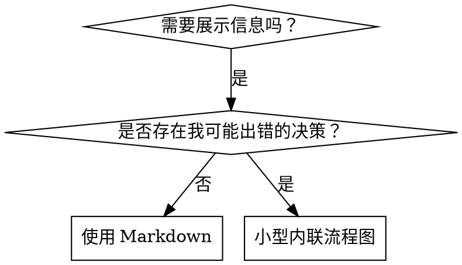

# 编写技能

## 概述

**编写技能就是将测试驱动开发应用于流程文档。**

**个人技能位于你的运行时的技能目录中**

你编写测试用例（包含子 Agent 的压力场景），观察它们失败（基线行为），编写技能（文档），观察测试通过（Agent 遵从要求），然后进行重构（堵住漏洞）。

**核心原则：** 如果你没有观察过 Agent 在没有该技能时失败，你就不知道该技能是否教了正确的内容。

**必备背景：** 在使用此技能之前，你必须理解 superpowers:test-driven-development。该技能定义了基本的红-绿-重构循环。此技能将 TDD 应用于文档。

**官方指南：** 有关 Anthropic 官方的技能编写最佳实践，请参阅 anthropic-best-practices.md。该文档提供了额外的模式和指南，作为对此技能中以 TDD 为重点的方法的补充。

## 什么是技能？

**技能**是经过验证的技术、模式或工具的参考指南。技能帮助未来的 Agent 找到并应用有效的方法。

**技能是：** 可复用的技术、模式、工具、参考指南

**技能不是：** 关于你曾经如何解决某个问题的叙事

## 技能的 TDD 映射

| TDD 概念 | 技能创建 |
|-------------|----------------|
| **测试用例** | 包含子 Agent 的压力场景 |
| **生产代码** | 技能文档（SKILL.md） |
| **测试失败（红）** | Agent 在没有技能时违反规则（基线） |
| **测试通过（绿）** | Agent 在技能存在时遵从要求 |
| **重构** | 在维持遵从性的同时堵住漏洞 |
| **先编写测试** | 在编写技能之前运行基线场景 |
| **观察它失败** | 记录 Agent 使用的确切合理化说辞 |
| **最小代码** | 编写技能以处理那些具体违规行为 |
| **观察它通过** | 验证 Agent 现在会遵从要求 |
| **重构循环** | 找出新的合理化说辞 → 堵住漏洞 → 重新验证 |

整个技能创建过程都遵循红-绿-重构。

## 何时创建技能
**在以下情况下创建：**
- 该技术并非你凭直觉就能想到的
- 你会在不同项目中再次参考它
- 该模式具有广泛适用性（并非项目特定）
- 其他人会从中受益

**不要为以下内容创建：**
- 一次性解决方案
- 已在其他地方得到充分记录的标准实践
- 项目特定的约定（将其放入你的指令文件中）
- 机械性约束（如果可以用正则表达式/验证来强制执行，就将其自动化——把文档留给需要判断的情况）

## 技能类型

### 技术
需要遵循具体步骤的方法（condition-based-waiting、root-cause-tracing）

### 模式
思考问题的方式（flatten-with-flags、test-invariants）

### 参考资料
API 文档、语法指南、工具文档（office docs）

## 目录结构


```
skills/
  skill-name/
    SKILL.md              # 主要参考资料（必需）
    supporting-file.*     # 仅在需要时
```

**扁平命名空间**——所有技能都位于一个可搜索的命名空间中

**以下内容使用单独的文件：**
1. **大量参考资料**（100+ 行）——API 文档、全面的语法说明
2. **可复用工具**——脚本、实用工具、模板

**以下内容保持内联：**
- 原则和概念
- 代码模式（< 50 行）
- 其他所有内容

## SKILL.md 结构
**前置元数据（YAML）：**
- 两个必填字段：`name` 和 `description`（所有受支持的字段请参阅 [agentskills.io/specification](https://agentskills.io/specification)）
- 总计最多 1024 个字符
- `name`：只能使用字母、数字和连字符（不得使用圆括号或特殊字符）
- `description`：使用第三人称，只描述何时使用（而不是它做什么）
  - 以“在……时使用……”开头，以聚焦触发条件
  - 包含具体的症状、情形和上下文
  - **绝不要概括该技能的流程或工作流**（原因请参阅 SDO 章节）
  - 如有可能，控制在 500 个字符以内

```markdown
---
name: Skill-Name-With-Hyphens
description: 在 [specific triggering conditions and symptoms] 时使用
---

# 技能名称

## 概述
这是什么？用 1-2 句话说明核心原则。

## 何时使用
[如果决策并不显而易见，请加入小型内联流程图]

包含症状和使用场景的项目符号列表
何时不应使用

## 核心模式（适用于技术/模式）
修改前/修改后的代码对比

## 快速参考
用于快速浏览常见操作的表格或项目符号列表

## 实现
对简单模式使用内联代码
对大型参考资料或可复用工具提供文件链接

## 常见错误
出错之处 + 修复方法

## 实际影响（可选）
具体成果
```


## 技能发现优化（SDO）
**对发现至关重要：** 未来的 Agent 需要找到你的技能

### 1. 丰富的描述字段

**目的：** 你的 Agent 会读取描述，以决定针对给定任务加载哪些技能。要让它回答：“我现在应该阅读这个技能吗？”

**格式：** 以“用于……时”开头，以聚焦触发条件

**关键：描述 = 何时使用，而不是技能做什么**

描述应当只说明触发条件。切勿在描述中概括技能的过程或工作流。

**这为何重要：** 测试表明，当描述概括了技能的工作流时，Agent 可能会依照描述行事，而不是阅读完整的技能内容。一条写着“在任务之间进行代码审查”的描述导致 Agent 只进行了一次审查，尽管技能的流程图清楚地显示了两次审查（先审查规格符合性，再审查代码质量）。

当描述被改为仅写“用于执行包含相互独立任务的实施计划时”（不概括工作流）后，Agent 正确地阅读了流程图，并遵循了两阶段审查流程。

**陷阱：** 概括工作流的描述会创造一条 Agent 将会采用的捷径。技能正文会变成 Agent 跳过的文档。

```yaml
# ❌ 错误：概括了工作流——Agent 可能会依照此描述行事，而不是阅读技能
描述: 用于执行计划时 - 为每个任务派遣子 Agent，并在任务之间进行代码审查

# ❌ 错误：包含过多过程细节
描述: 用于 TDD - 先编写测试，观察它失败，编写最少量代码，重构

# ✅ 正确：只有触发条件，没有工作流概述
描述: 用于在当前会话中执行包含相互独立任务的实施计划时

# ✅ 正确：只有触发条件
描述: 用于实现任何功能或修复任何错误时，在编写实现代码之前
```

**内容：**
- 使用具体的触发因素、症状和情形来表明此技能适用
- 描述*问题*（竞态条件、行为不一致），而不是*特定于语言的症状*（setTimeout、sleep）
- 除非技能本身特定于某项技术，否则应保持触发条件与技术无关
- 如果技能特定于某项技术，请在触发条件中明确说明
- 使用第三人称撰写（会被注入系统提示词）
- **切勿概括技能的过程或工作流**

```yaml
# ❌ 不佳：过于抽象、含糊，且未说明何时使用
description: 用于异步测试

# ❌ 不佳：使用第一人称
description: 当异步测试不稳定时，我可以帮助你处理

# ❌ 不佳：提到了技术，但该技能并非专门针对该技术
description: 用于测试使用 setTimeout/sleep 且不稳定时

# ✅ 良好：以“用于……时”开头，描述问题，不包含工作流
description: 用于测试存在竞态条件、时序依赖，或通过/失败结果不一致时

# ✅ 良好：针对特定技术的技能，具有明确的触发条件
description: 用于使用 React Router 并处理身份验证重定向时
```

### 2. 关键词覆盖
使用 Agent 会搜索的词语：
- 错误消息："Hook timed out"、"ENOTEMPTY"、"race condition"
- 症状："flaky"、"hanging"、"zombie"、"pollution"
- 同义词："timeout/hang/freeze"、"cleanup/teardown/afterEach"
- 工具：实际命令、库名称、文件类型

### 3. 描述性命名

**使用主动语态、动词优先：**
- ✅ `creating-skills`，而不是 `skill-creation`
- ✅ `condition-based-waiting`，而不是 `async-test-helpers`

### 4. Token 效率（关键）

**问题：** getting-started 和经常引用的技能会加载到每一次对话中。每个 Token 都至关重要。

**目标字数：**
- getting-started 工作流：每个 <150 词
- 经常加载的技能：总计 <200 词
- 其他技能：<500 词（仍需简洁）

**技巧：**

**将细节移至工具帮助中：**
```bash
# ❌ 错误：在 SKILL.md 中记录所有标志
search-conversations 支持 --text、--both、--after DATE、--before DATE、--limit N

# ✅ 正确：引用 --help
search-conversations 支持多种模式和筛选器。运行 --help 了解详情。
```

**使用交叉引用：**
```markdown
# ❌ 错误：重复工作流细节
搜索时，使用模板分派子 Agent...
[20 行重复的说明]

# ✅ 正确：引用其他技能
始终使用子 Agent（可节省 50-100x 的上下文）。强制要求：工作流必须使用 [other-skill-name]。
```

**压缩示例：**
```markdown
# ❌ 错误：冗长示例（42 个词）
你的人类伙伴："我们之前是如何处理 React Router 中的身份验证错误的？"
你：我会在过去的对话中搜索 React Router 身份验证模式。
[派发子 Agent，搜索查询："React Router 身份验证错误处理 401"]

# ✅ 正确：最简示例（20 个词）
伙伴："我们是如何处理 React Router 中的身份验证错误的？"
你：正在搜索……
[派发子 Agent → 综合]
```

**消除冗余：**
- 不要重复交叉引用的技能中已有的内容
- 不要解释从命令本身就显而易见的内容
- 不要为同一种模式提供多个示例

**验证：**
```bash
wc -w skills/path/SKILL.md
# getting-started 工作流：目标是每个少于 150 个词
# 其他经常加载的内容：目标是总计少于 200 个词
```

**根据你所做的事情或核心洞见来命名：**
- ✅ `condition-based-waiting` 优于 `async-test-helpers`
- ✅ 使用 `using-skills`，而不是 `skill-usage`
- ✅ `flatten-with-flags` 优于 `data-structure-refactoring`
- ✅ `root-cause-tracing` 优于 `debugging-techniques`

**动名词（-ing）很适合用于过程：**
- `creating-skills`、`testing-skills`、`debugging-with-logs`
- 主动式，描述你正在采取的行动

### 5. 交叉引用其他技能

**编写引用其他技能的文档时：**

仅使用技能名称，并带有明确的要求标记：
- ✅ 正确：`**必需的子技能：** 使用 superpowers:test-driven-development`
- ✅ 正确：`**必需背景：** 你必须理解 superpowers:systematic-debugging`
- ❌ 错误：`参见 skills/testing/test-driven-development`（不清楚是否为必需项）
- ❌ 错误：`@skills/testing/test-driven-development/SKILL.md`（强制加载，消耗上下文）

**为什么不用 @ 链接：** `@` 语法会立即强制加载文件，在你需要它们之前就消耗 200k+ 的上下文。

## 流程图用法


**仅在以下情况使用流程图：**
- 非显而易见的决策点
- 你可能过早停止的流程循环
- “何时使用 A、何时使用 B”的决策

**切勿将流程图用于：**
- 参考资料 → 表格、列表
- 代码示例 → Markdown 代码块
- 线性指令 → 编号列表
- 没有语义含义的标签（step1、helper2）

有关 Graphviz 样式规则，请参阅此目录中的 `graphviz-conventions.dot`。

**为你的人类伙伴进行可视化：** 使用此目录中的 `render-graphs.js` 将某个技能的流程图渲染为 SVG：
```bash
./render-graphs.js ../some-skill           # 每个图表分别渲染
./render-graphs.js ../some-skill --combine # 所有图表合并到一个 SVG 中
```

## 代码示例

**一个出色的示例胜过许多个平庸的示例**

选择最相关的语言：
- 测试技术 → TypeScript/JavaScript
- 系统调试 → Shell/Python
- 数据处理 → Python

**良好示例：**
- 完整且可运行
- 注释充分，解释为什么这样做
- 源自真实场景
- 清晰地展示模式
- 可直接改编（而非通用模板）

**不要：**
- 使用 5+ 种语言来实现
- 创建填空式模板
- 编写刻意编造的示例

你擅长移植——一个出色的示例就足够了。

## 文件组织
### 自包含技能
```
defense-in-depth/
  SKILL.md    # 所有内容均内联
```
适用场景：所有内容都能容纳，无需大量参考资料

### 带有可复用工具的技能
```
condition-based-waiting/
  SKILL.md    # 概述 + 模式
  example.ts  # 可供调整的可用辅助函数
```
适用场景：工具是可复用代码，而不只是叙述性内容

### 包含大量参考资料的技能
```
pptx/
  SKILL.md       # 概述 + 工作流
  pptxgenjs.md   # 600 行 API 参考
  ooxml.md       # 500 行 XML 结构
  scripts/       # 可执行工具
```
何时：参考资料过大，无法内联

## 铁律（与 TDD 相同）
```
没有先失败的测试，就不能编写技能
```

这适用于新技能以及对现有技能的编辑。

在测试之前编写技能？删除它。重新开始。
未经测试就编辑技能？同样是违规。

**没有例外：**
- “简单的增补”也不例外
- “只是添加一个章节”也不例外
- “文档更新”也不例外
- 不要把未经测试的更改作为“参考”保留下来
- 不要在运行测试时进行“调整”
- 删除就是删除

**必备背景知识：** superpowers:test-driven-development 技能解释了为什么这很重要。同样的原则也适用于文档。

## 测试所有技能类型
不同类型的技能需要采用不同的测试方法：

### 纪律强制型技能（规则/要求）

**示例：** TDD、verification-before-completion、designing-before-coding

**测试方式：**
- 理论问题：他们理解这些规则吗？
- 压力场景：他们在压力下会遵守吗？
- 多重压力叠加：时间压力 + 沉没成本 + 精疲力竭
- 识别合理化说辞，并添加明确的反驳

**成功标准：** Agent 在最大压力下仍遵守规则

### 技法型技能（操作指南）

**示例：** condition-based-waiting、root-cause-tracing、defensive-programming

**测试方式：**
- 应用场景：他们能正确应用该技法吗？
- 变体场景：他们能处理边界情况吗？
- 信息缺失测试：指令是否存在缺漏？

**成功标准：** Agent 成功将该技法应用于新场景

### 模式型技能（心智模型）

**示例：** reducing-complexity、information-hiding 概念

**测试方式：**
- 识别场景：他们能识别出何时适用该模式吗？
- 应用场景：他们能使用该心智模型吗？
- 反例：他们知道何时不应应用吗？

**成功标准：** Agent 正确识别何时以及如何应用该模式

### 参考型技能（文档/API）

**示例：** API 文档、命令参考、库指南

**测试方式：**
- 检索场景：他们能找到正确的信息吗？
- 应用场景：他们能正确使用所找到的信息吗？
- 缺漏测试：是否涵盖了常见用例？

**成功标准：** Agent 找到并正确应用参考信息

## 跳过测试的常见合理化说辞

| 借口 | 事实 |
|--------|---------|
| "技能显然很清楚" | 对你清楚 ≠ 对其他 Agent 清楚。测试它。 |
| "它只是一个参考资料" | 参考资料也可能存在缺漏和不清楚的部分。测试检索。 |
| "测试太小题大做了" | 未经测试的技能总会有问题。无一例外。花 15 分钟测试能节省数小时。 |
| "如果出现问题，我再测试" | 出现问题 = Agent 无法使用该技能。在部署之前测试。 |
| "测试太繁琐了" | 测试远没有在生产环境中调试糟糕的技能那么繁琐。 |
| "我确信它很好" | 过度自信必然会带来问题。无论如何都要测试。 |
| "理论审查就足够了" | 阅读 ≠ 使用。测试应用场景。 |
| "没时间测试" | 部署未经测试的技能，会浪费更多时间在之后的修复上。 |

**所有这些都意味着：部署前进行测试。无一例外。**

## 让形式与失败相匹配
在编写指导之前，先对基线失败进行分类。用于严防一种失败类型的形式，会在另一种失败类型上产生可测量的反效果。

| 基线失败 | 正确形式 | 错误形式 |
|---|---|---|
| 在压力下跳过/违反规则（明知不该如此，却仍然这样做） | 禁令 + 反合理化表格 + 红旗项（见下文的防弹加固部分） | 软性指导（“优先……”、“考虑……”） |
| 遵从规则，但输出形态错误（提示词臃肿、结论被埋没、重述规范） | 正向配方或契约：说明输出是什么——按顺序列出其组成部分 | 禁令列表（“不要重述”、“绝不叙述过程”） |
| 从其本已产出的内容中遗漏某个必需元素 | 结构化形式：在其填写的模板中设置 REQUIRED 字段或槽位 | 模板附近的文字提醒 |
| 行为应取决于某个条件 | 以可观察谓词为依据的条件规则（“如果简报存在，就引用它”） | 无条件规则 + 豁免条款 |

**为什么禁令会在塑形问题上适得其反：**当存在相互竞争的激励（“让提示词自包含”）时，Agent 会与“不要做 X”讨价还价。在针对分派提示词指导的措辞正面对照测试中，禁令组产生的不需要内容明显多于配方组（分布完全分离），而且趋势上甚至比无指导对照组更差——请针对你自己的情况进行微型测试，而不要想当然；但绝不要默认采用禁令。配方不会留下任何讨价还价的余地：输出要么符合规定的形态，要么不符合。

**无论选择哪种形式，都要遵守以下规则：**
- **不要添加细微限定条款。**“不要做 X，除非这很重要”会重新开启讨价还价——在同一组措辞测试中，仅向一个原本胜出的配方追加一条细微限定条款，就使其从稳定一致退化为波动嘈杂。应将真正的例外表述为以可观察谓词为依据的独立条件规则。
- **豁免条款并不能限定适用范围。**“此限制不适用于代码块”仍然会抑制代码块。如果输出的一部分必须获得豁免，就重构规则，使该规则无法作用到这一部分。

## 对技能进行防弹加固，以抵御合理化

强制执行纪律的技能（如 TDD）需要能够抵御合理化。Agent 很聪明，在压力下会找到漏洞。

**适用范围：**本工具包适用于纪律失守——即 Agent 明知规则，却在压力下跳过它。对于输出形态错误或遗漏元素的情况，基于禁令的防弹加固会适得其反；请改用“使形式与失败相匹配”中的形式。

**心理学说明：**理解说服技巧为何有效，有助于你系统地应用它们。有关权威、承诺、稀缺、社会认同和统一性原则的研究基础（Cialdini, 2021; Meincke et al., 2025），请参阅 persuasion-principles.md。

### 明确封堵每一个漏洞

不要只是陈述规则——还要禁止具体的规避手段：

<Bad>
```markdown
在测试之前写了代码？删除它。
```
</Bad>

<Good>
```markdown
在测试之前写了代码？删除它。重新开始。

**没有例外：**
- 不要把它留作“参考”
- 不要在编写测试时“改造”它
- 不要查看它
- 删除就是删除
```
</Good>

### 回应“精神与字面”论点
尽早加入根本原则：

```markdown
**违反规则的字面要求，就是违反规则的精神。**
```

这会彻底堵住整类“我遵循的是规则精神”式的合理化借口。

### 构建反合理化表格

记录基线测试中发现的合理化借口（见下方的“测试”部分）。Agent 提出的每一个借口都要放进表格中：

```markdown
| 借口 | 事实 |
|--------|---------|
| "太简单了，没必要测试" | 简单的代码也会出错。测试只需 30 秒。 |
| "我之后再测试" | 测试立即通过什么也证明不了。 |
| "事后测试也能达到相同目标" | 事后测试 = "这段代码做什么？" 测试先行 = "这段代码应该做什么？" |
```

### 创建红旗清单

让 Agent 在进行合理化时能够轻松自查：

```markdown
## 红旗——停止并从头开始

- 先写代码，后写测试
- "我已经手动测试过了"
- "事后测试也能达到相同目的"
- "重要的是精神，而不是仪式"
- "这次不一样，因为……"

**所有这些都意味着：删除代码。使用 TDD 从头开始。**
```

### 更新 SDO 以涵盖违规征兆

添加到 description 中：你正要违反规则时会出现的征兆：

```yaml
description: 在实现任何功能或修复任何缺陷时使用，且应在编写实现代码之前使用
```

## 技能的 RED-GREEN-REFACTOR
遵循 TDD 循环：

### RED：编写失败测试（基线）

在不使用该技能的情况下，让子 Agent 运行压力场景。记录其确切行为：
- 他们做出了哪些选择？
- 他们使用了哪些合理化说辞（逐字记录）？
- 哪些压力触发了违规行为？

这就是“观察测试失败”——你必须在编写技能之前，先看看 Agent 自然而然会怎么做。

### GREEN：编写最小技能

编写技能来应对那些特定的合理化说辞。不要为假设情况添加额外内容。

在使用该技能的情况下运行相同场景。Agent 现在应该遵从要求。

### REFACTOR：堵住漏洞

Agent 找到了新的合理化说辞？添加明确的反驳。重新测试，直到无懈可击。

### 在完整场景之前对措辞进行微测试

完整的压力场景运行是最终关卡，但每次迭代运行起来都缓慢且昂贵。先使用微测试验证措辞本身：

1. **每次调用使用一个全新上下文样本**——一次原始 API 调用；如果你没有 API 访问权限，则使用一次单轮子 Agent 调用。System prompt = 指导内容将实际存在于其中的真实上下文（完整技能或提示词模板，而不是孤立的指导内容）；user message = 一项会诱发失败行为的任务。
2. **始终包含无指导对照组。** 如果对照组没有表现出该失败行为，就没有任何需要修复的东西——停止，不要编写该指导内容。
3. **每个变体重复 5 次以上。** 单个样本会骗人。
4. **手动阅读每个被标记的匹配项。** 如果愿意，你可以通过程序进行评分，但模板复述和被引用的反例会伪装成命中项；仅依靠自动计数会同时夸大失败和成功。
5. **方差是一项指标。** 当指导内容生效时，各次重复结果会收敛到相同的形态。五次重复产生五种不同的解释，意味着措辞不具约束力——在增加文字之前，先收紧形式。

微测试验证措辞；对于纪律型技能，它们不能取代压力场景。

**测试方法：** 完整的测试方法请参阅 [testing-skills-with-subagents.md](testing-skills-with-subagents.md)：
- 如何编写压力场景
- 压力类型（时间、沉没成本、权威、精疲力竭）
- 系统性地堵住漏洞
- 元测试技术

## 反模式
### ❌ 叙事性示例
“在会话 2025-10-03 中，我们发现空的 projectDir 导致了……”
**为什么不好：** 过于具体，不可复用

### ❌ 多语言稀释
example-js.js, example-py.py, example-go.go
**为什么不好：** 质量平庸，维护负担沉重

### ❌ 流程图中的代码
```dot
step1 [label="导入 fs"];
step2 [label="读取文件"];
```
**为什么不好：** 无法复制粘贴，难以阅读

### ❌ 通用标签
helper1, helper2, step3, pattern4
**为什么不好：** 标签应具有语义

## 停止：在转到下一个技能之前

**写完任何一个技能后，你都必须停止并完成部署流程。**

**严禁：**
- 在未逐一测试的情况下批量创建多个技能
- 在当前技能通过验证之前转到下一个技能
- 因为“批处理更高效”而跳过测试

**以下部署检查清单对每一个技能都是强制性的。**

部署未经测试的技能 = 部署未经测试的代码。这违反了质量标准。

## 技能创建检查清单（TDD 改编版）
**重要：为下面的每一个检查清单项创建一个 todo。**

**RED 阶段——编写失败测试：**
- [ ] 创建压力场景（对于纪律型技能，组合 3 种以上压力）
- [ ] 在不使用技能的情况下运行场景——逐字记录基线行为
- [ ] 识别合理化说辞/失败中的模式

**GREEN 阶段——编写最小技能：**
- [ ] 名称仅使用字母、数字、连字符（不得使用圆括号/特殊字符）
- [ ] YAML 前置元数据包含必需的 `name` 和 `description` 字段（最多 1024 个字符；参见[规范](https://agentskills.io/specification)）
- [ ] 描述以“在……时使用”开头，并包含具体的触发条件/症状
- [ ] 描述使用第三人称撰写
- [ ] 全文包含用于搜索的关键词（错误、症状、工具）
- [ ] 提供清晰的概述，并包含核心原则
- [ ] 处理 RED 阶段识别出的具体基线失败
- [ ] 指导形式与失败类型相匹配（参见“使形式与失败相匹配”）
- [ ] 对于行为塑造型指导：将措辞与无指导对照进行微测试（重复 5 次以上，手动阅读每一条被标记的匹配结果）——纯参考型技能为 N/A
- [ ] 内联代码，或者链接到单独的文件
- [ ] 提供一个极佳的示例（不要使用多种语言）
- [ ] 在使用技能的情况下运行场景——验证 Agent 现在会遵从要求

**REFACTOR 阶段——堵住漏洞：**
- [ ] 识别测试中出现的新的合理化说辞
- [ ] 添加明确的反驳措施（如果是纪律型技能）
- [ ] 根据所有测试迭代构建合理化说辞表格
- [ ] 创建红旗项列表
- [ ] 反复重新测试，直至无懈可击

**质量检查：**
- [ ] 仅在决策并非显而易见时使用小型流程图
- [ ] 快速参考表
- [ ] 常见错误部分
- [ ] 不进行叙事性讲述
- [ ] 仅为工具或大量参考资料提供支持文件

**部署：**
- [ ] 将技能提交到 git，并推送到你的 fork（如果已配置）
- [ ] 考虑通过 PR 回馈贡献（如果具有广泛用途）

## 发现工作流
未来的 Agent 如何找到你的技能：

1. **遇到问题**（“测试不稳定”）
2. **搜索技能**（用 grep 搜索描述、浏览类别）
3. **找到 SKILL**（描述匹配）
4. **浏览概述**（这相关吗？）
5. **阅读模式**（快速参考表）
6. **加载示例**（仅在实现时）

**针对这一流程进行优化**——尽早并经常放入可搜索的术语。

## 核心结论

**创建技能就是面向流程文档的 TDD。**

同一条铁律：没有先失败的测试，就不能创建技能。
同一个循环：RED（基线）→ GREEN（编写技能）→ REFACTOR（堵住漏洞）。
同样的收益：质量更高、意外更少、结果无懈可击。

如果你对代码遵循 TDD，那么对技能也应遵循 TDD。这是将同一种纪律应用于文档。
